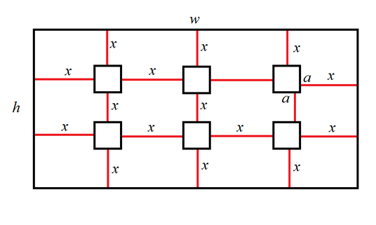

<h1 style='text-align: center;'> G. Perfectionist Arkadiy</h1>

<h5 style='text-align: center;'>time limit per test: 1 second</h5>
<h5 style='text-align: center;'>memory limit per test: 256 megabytes</h5>

Arkadiy has lots square photos with size *a* × *a*. He wants to put some of them on a rectangular wall with size *h* × *w*. 

The photos which Arkadiy will put on the wall must form a rectangular grid and the distances between neighboring vertically and horizontally photos and also the distances between outside rows and columns of photos to the nearest bound of the wall must be equal to *x*, where *x* is some non-negative real number. Look on the picture below for better understanding of the statement.

  Arkadiy haven't chosen yet how many photos he would put on the wall, however, he want to put at least one photo. Your task is to determine the minimum value of *x* which can be obtained after putting photos, or report that there is no way to put positive number of photos and satisfy all the constraints. Suppose that Arkadiy has enough photos to make any valid arrangement according to the constraints.

## Note

 that Arkadiy wants to put at least one photo on the wall. The photos should not overlap, should completely lie inside the wall bounds and should have sides parallel to the wall sides.

## Input

The first line contains three integers *a*, *h* and *w* (1 ≤ *a*, *h*, *w* ≤ 109) — the size of photos and the height and the width of the wall.

## Output

Print one non-negative real number — the minimum value of *x* which can be obtained after putting the photos on the wall. The absolute or the relative error of the answer must not exceed 10- 6.

Print -1 if there is no way to put positive number of photos and satisfy the constraints.

## Examples

## Input


```
2 18 13  

```
## Output


```
0.5  

```
## Input


```
4 4 4  

```
## Output


```
0  

```
## Input


```
3 4 3  

```
## Output


```
-1  

```
## Note

In the first example Arkadiy can put 7 rows of photos with 5 photos in each row, so the minimum value of *x* equals to 0.5.

In the second example Arkadiy can put only 1 photo which will take the whole wall, so the minimum value of *x* equals to 0.

In the third example there is no way to put positive number of photos and satisfy the constraints described in the statement, so the answer is -1.


#### tags 

#2700 #*special #number_theory 