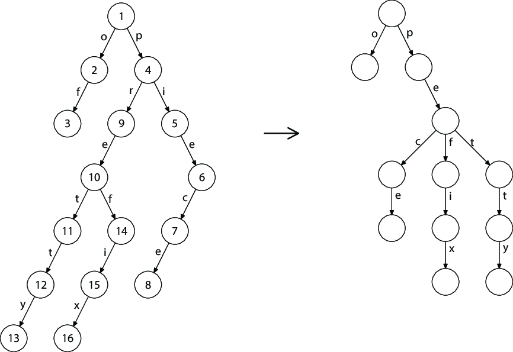

<h1 style='text-align: center;'> C. Peterson Polyglot</h1>

<h5 style='text-align: center;'>time limit per test: 4 seconds</h5>
<h5 style='text-align: center;'>memory limit per test: 512 megabytes</h5>

Peterson loves to learn new languages, but his favorite hobby is making new ones. Language is a set of words, and word is a sequence of lowercase Latin letters.

Peterson makes new language every morning. It is difficult task to store the whole language, so Peterson have invented new data structure for storing his languages which is called broom. Broom is rooted tree with edges marked with letters. Initially broom is represented by the only vertex — the root of the broom. When Peterson wants to add new word to the language he stands at the root and processes the letters of new word one by one. Consider that Peterson stands at the vertex *u*. If there is an edge from *u* marked with current letter, Peterson goes through this edge. Otherwise Peterson adds new edge from *u* to the new vertex *v*, marks it with the current letter and goes through the new edge. Size of broom is the number of vertices in it.

In the evening after working day Peterson can't understand the language he made this morning. It is too difficult for bored Peterson and he tries to make it simpler. Simplification of the language is the process of erasing some letters from some words of this language. Formally, Peterson takes some positive integer *p* and erases *p*-th letter from all the words of this language having length at least *p*. Letters in words are indexed starting by 1. Peterson considers that simplification should change at least one word, i.e. there has to be at least one word of length at least *p*. Peterson tries to make his language as simple as possible, so he wants to choose *p* such that the size of the broom for his simplified language is as small as possible.

Peterson is pretty annoyed with this task so he asks you for help. Write a program to find the smallest possible size of the broom and integer *p*.

## Input

The first line of input contains integer *n* (2 ≤ *n* ≤ 3·105) — the size of the broom.

Next *n* - 1 lines describe the broom: *i*-th of them contains integers *u**i*, *v**i* and letter *x**i* — describing the edge from *u**i* to *v**i* marked with letter *x**i*.

Vertices are numbered from 1 to *n*. All *x**i* are lowercase latin letters. Vertex 1 is the root of the broom.

Edges describe correct broom which is made from Peterson's language.

## Output

The first line of output should contain the minimum possible size of the broom after its simplification. The second line of output should contain integer *p* to choose. If there are several suitable *p* values, print the smallest one.

## Examples

## Input


```
5  
1 2 c  
2 3 a  
3 4 t  
2 5 t  

```
## Output


```
3  
2  

```
## Input


```
16  
1 2 o  
2 3 f  
1 4 p  
4 5 i  
5 6 e  
6 7 c  
7 8 e  
4 9 r  
9 10 e  
10 11 t  
11 12 t  
12 13 y  
10 14 f  
14 15 i  
15 16 x  

```
## Output


```
12  
2  

```
## Note



Broom from the second sample test can be built using language "piece", "of", "pie", "pretty", "prefix". Its simplification with *p* = 2 obtains the language of words "pece", "o", "pe", "petty", "pefix". This language gives us the broom with minimum possible size.


#### tags 

#2500 #brute_force #dfs_and_similar #dsu #hashing #strings #trees 