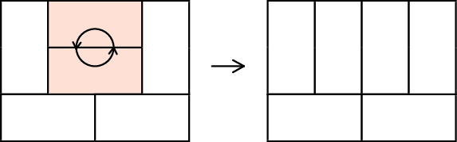
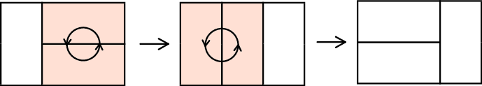

<h1 style='text-align: center;'> D. Parquet Re-laying</h1>

<h5 style='text-align: center;'>time limit per test: 2 seconds</h5>
<h5 style='text-align: center;'>memory limit per test: 512 megabytes</h5>

Peter decided to lay a parquet in the room of size *n* × *m*, the parquet consists of tiles of size 1 × 2. When the workers laid the parquet, it became clear that the tiles pattern looks not like Peter likes, and workers will have to re-lay it.

The workers decided that removing entire parquet and then laying it again is very difficult task, so they decided to make such an operation every hour: remove two tiles, which form a 2 × 2 square, rotate them 90 degrees and put them back on the same place.

  They have no idea how to obtain the desired configuration using these operations, and whether it is possible at all.

Help Peter to make a plan for the workers or tell that it is impossible. The plan should contain at most 100 000 commands.

## Input

The first line contains integer *n* and *m*, size of the room (1 ≤ *n*, *m* ≤ 50). At least one of them is even number.

The following *n* lines contain *m* characters each, the description of the current configuration of the parquet tiles. Each character represents the position of the half-tile. Characters 'L', 'R', 'U' and 'D' correspond to the left, right, upper and lower halves, respectively.

The following *n* lines contain *m* characters each, describing the desired configuration in the same format.

## Output

In the first line output integer *k*, the number of operations. In the next *k* lines output description of operations. The operation is specified by coordinates (row and column) of the left upper half-tile on which the operation is performed.

If there is no solution, output -1 in the first line.

## Examples

## Input


```
2 3  
ULR  
DLR  
LRU  
LRD  

```
## Output


```
2  
1 2  
1 1  

```
## Input


```
4 3  
ULR  
DLR  
LRU  
LRD  
ULR  
DUU  
UDD  
DLR
```
## Output


```
3  
3 1  
3 2  
2 2
```
## Note

In the first sample test first operation is to rotate two rightmost tiles, after this all tiles lie vertically. Second operation is to rotate two leftmost tiles, after this we will get desired configuration.

  

#### tags 

#2700 #constructive_algorithms 