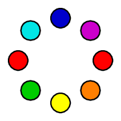

<h1 style='text-align: center;'> B. Easter Eggs</h1>

<h5 style='text-align: center;'>time limit per test: 2 seconds</h5>
<h5 style='text-align: center;'>memory limit per test: 256 megabytes</h5>

The Easter Rabbit laid *n* eggs in a circle and is about to paint them. 

Each egg should be painted one color out of 7: red, orange, yellow, green, blue, indigo or violet. Also, the following conditions should be satisfied:

* Each of the seven colors should be used to paint at least one egg.
* Any four eggs lying sequentially should be painted different colors.

Help the Easter Rabbit paint the eggs in the required manner. We know that it is always possible.

## Input

The only line contains an integer *n* — the amount of eggs (7 ≤ *n* ≤ 100).

## Output

Print one line consisting of *n* characters. The *i*-th character should describe the color of the *i*-th egg in the order they lie in the circle. The colors should be represented as follows: "R" stands for red, "O" stands for orange, "Y" stands for yellow, "G" stands for green, "B" stands for blue, "I" stands for indigo, "V" stands for violet.

If there are several answers, print any of them.

## Examples

## Input


```
8  

```
## Output


```
ROYGRBIV  

```
## Input


```
13  

```
## Output


```
ROYGBIVGBIVYG  

```
## Note

The way the eggs will be painted in the first sample is shown on the picture: 

  

#### tags 

#1200 #constructive_algorithms #implementation 