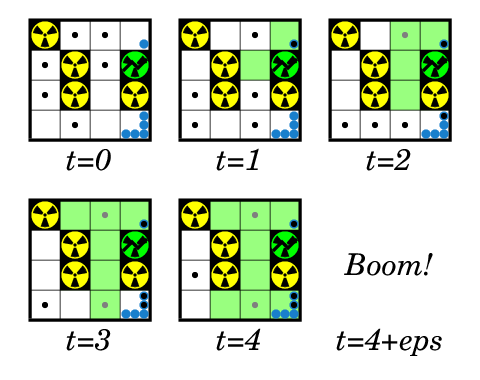

<h1 style='text-align: center;'> E. Evacuation</h1>

<h5 style='text-align: center;'>time limit per test: 1 second</h5>
<h5 style='text-align: center;'>memory limit per test: 256 megabytes</h5>

They've screwed something up yet again... In one nuclear reactor of a research station an uncontrolled reaction is in progress and explosion which will destroy the whole station will happen soon.

The station is represented by a square *n* × *n* divided into 1 × 1 blocks. Each block is either a reactor or a laboratory. There can be several reactors and exactly one of them will explode soon. The reactors can be considered impassable blocks, but one can move through laboratories. Between any two laboratories, which are in adjacent blocks, there is a corridor. Blocks are considered adjacent if they have a common edge.

In each laboratory there is some number of scientists and some number of rescue capsules. Once the scientist climbs into a capsule, he is considered to be saved. Each capsule has room for not more than one scientist.

The reactor, which is about to explode, is damaged and a toxic coolant trickles from it into the neighboring blocks. The block, which contains the reactor, is considered infected. Every minute the coolant spreads over the laboratories through corridors. If at some moment one of the blocks is infected, then the next minute all the neighboring laboratories also become infected. Once a lab is infected, all the scientists there that are not in rescue capsules die. The coolant does not spread through reactor blocks.

There are exactly *t* minutes to the explosion. Any scientist in a minute can move down the corridor to the next lab, if it is not infected. On any corridor an unlimited number of scientists can simultaneously move in both directions. It is believed that the scientists inside a lab moves without consuming time. Moreover, any scientist could get into the rescue capsule instantly. It is also believed that any scientist at any given moment always has the time to perform their actions (move from the given laboratory into the next one, or climb into the rescue capsule) before the laboratory will be infected.

Find the maximum number of scientists who will be able to escape.

## Input

The first line contains two integers *n* and *t* (2 ≤ *n* ≤ 10, 1 ≤ *t* ≤ 60). Each of the next *n* lines contains *n* characters. These lines describe the scientists' locations. Then exactly one empty line follows. Each of the next *n* more lines contains *n* characters. These lines describe the rescue capsules' locations.

In the description of the scientists' and the rescue capsules' locations the character "Y" stands for a properly functioning reactor, "Z" stands for the malfunctioning reactor. The reactors' positions in both descriptions coincide. There is exactly one malfunctioning reactor on the station. The digits "0" - "9" stand for the laboratories. In the description of the scientists' locations those numbers stand for the number of scientists in the corresponding laboratories. In the rescue capsules' descriptions they stand for the number of such capsules in each laboratory.

## Output

Print a single number — the maximum number of scientists who will manage to save themselves.

## Examples

## Input


```
3 3  
1YZ  
1YY  
100  
  
0YZ  
0YY  
003  

```
## Output


```
2
```
## Input


```
4 4  
Y110  
1Y1Z  
1Y0Y  
0100  
  
Y001  
0Y0Z  
0Y0Y  
0005  

```
## Output


```
3
```
## Note

In the second sample the events could take place as follows: 

  

#### tags 

#2300 #flows #graphs #shortest_paths 