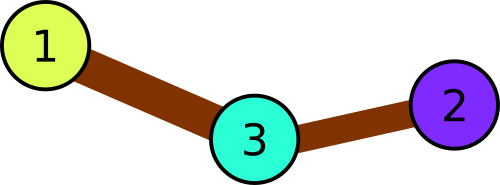
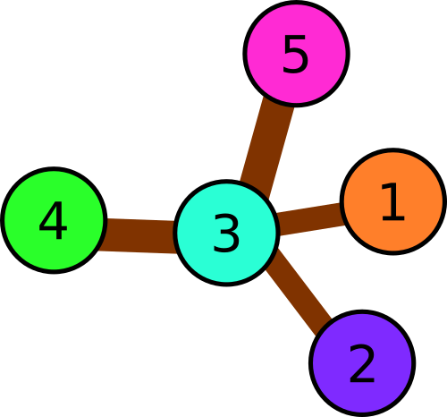
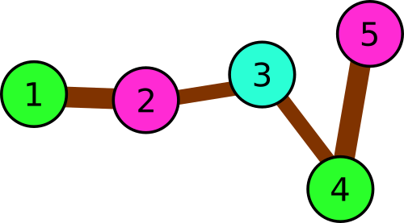

<h1 style='text-align: center;'> C. Andryusha and Colored Balloons</h1>

<h5 style='text-align: center;'>time limit per test: 2 seconds</h5>
<h5 style='text-align: center;'>memory limit per test: 256 megabytes</h5>

Andryusha goes through a park each day. The squares and paths between them look boring to Andryusha, so he decided to decorate them.

The park consists of *n* squares connected with (*n* - 1) bidirectional paths in such a way that any square is reachable from any other using these paths. Andryusha decided to hang a colored balloon at each of the squares. The baloons' colors are described by positive integers, starting from 1. In order to make the park varicolored, Andryusha wants to choose the colors in a special way. More precisely, he wants to use such colors that if *a*, *b* and *c* are distinct squares that *a* and *b* have a direct path between them, and *b* and *c* have a direct path between them, then balloon colors on these three squares are distinct.

Andryusha wants to use as little different colors as possible. Help him to choose the colors!

## Input

The first line contains single integer *n* (3 ≤ *n* ≤ 2·105) — the number of squares in the park.

Each of the next (*n* - 1) lines contains two integers *x* and *y* (1 ≤ *x*, *y* ≤ *n*) — the indices of two squares directly connected by a path.

It is guaranteed that any square is reachable from any other using the paths.

## Output

In the first line print single integer *k* — the minimum number of colors Andryusha has to use.

In the second line print *n* integers, the *i*-th of them should be equal to the balloon color on the *i*-th square. Each of these numbers should be within range from 1 to *k*.

## Examples

## Input


```
3  
2 3  
1 3  

```
## Output


```
3  
1 3 2 
```
## Input


```
5  
2 3  
5 3  
4 3  
1 3  

```
## Output


```
5  
1 3 2 5 4 
```
## Input


```
5  
2 1  
3 2  
4 3  
5 4  

```
## Output


```
3  
1 2 3 1 2 
```
## Note

In the first sample the park consists of three squares: 1 → 3 → 2. Thus, the balloon colors have to be distinct.

  Illustration for the first sample. In the second example there are following triples of consequently connected squares: 

* 1 → 3 → 2
* 1 → 3 → 4
* 1 → 3 → 5
* 2 → 3 → 4
* 2 → 3 → 5
* 4 → 3 → 5

 We can see that each pair of squares is encountered in some triple, so all colors have to be distinct.  Illustration for the second sample. In the third example there are following triples: 

* 1 → 2 → 3
* 2 → 3 → 4
* 3 → 4 → 5

 We can see that one or two colors is not enough, but there is an answer that uses three colors only.  Illustration for the third sample. 

#### tags 

#1600 #dfs_and_similar #graphs #greedy #trees 