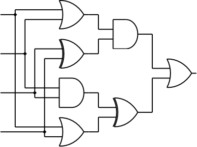

<h1 style='text-align: center;'> E. Twisted Circuit</h1>

<h5 style='text-align: center;'>time limit per test: 2 seconds</h5>
<h5 style='text-align: center;'>memory limit per test: 64 megabytes</h5>

  ## Input

The input consists of four lines, each line containing a single digit 0 or 1.

## Output

## Output

 a single digit, 0 or 1.

## Example

## Input


```
0  
1  
1  
0  

```
## Output


```
0  

```


#### tags 

#2000 #*special #brute_force #implementation 