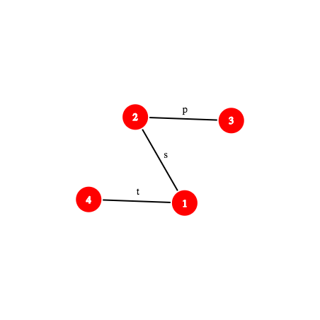
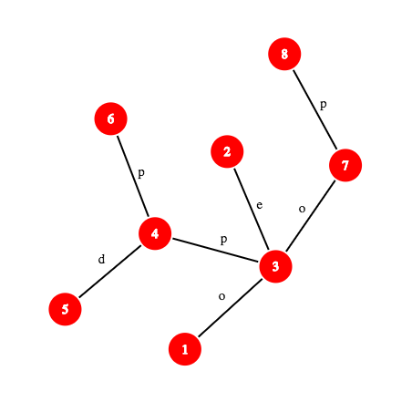

<h1 style='text-align: center;'> D. Rap God</h1>

<h5 style='text-align: center;'>time limit per test: 7 seconds</h5>
<h5 style='text-align: center;'>memory limit per test: 256 megabytes</h5>

Rick is in love with Unity. But Mr. Meeseeks also love Unity, so Rick and Mr. Meeseeks are "love rivals". 

Unity loves rap, so it decided that they have to compete in a rap game (battle) in order to choose the best. Rick is too nerds, so instead he's gonna make his verse with running his original algorithm on lyrics "Rap God" song.

  His algorithm is a little bit complicated. He's made a tree with *n* vertices numbered from 1 to *n* and there's a lowercase english letter written on each edge. He denotes *str*(*a*, *b*) to be the string made by writing characters on edges on the shortest path from *a* to *b* one by one (a string of length equal to distance of *a* to *b*). ## Note

 that *str*(*a*, *b*) is reverse of *str*(*b*, *a*) and *str*(*a*, *a*) is empty.

 In order to make the best verse he can, he needs to answer some queries, but he's not a computer scientist and is not able to answer those queries, so he asked you to help him. Each query is characterized by two vertices *x* and *y* (*x* ≠ *y*). Answer to this query is the number of vertices like *z* such that *z* ≠ *x*, *z* ≠ *y* and *str*(*x*, *y*) is lexicographically larger than *str*(*x*, *z*).

String *x*  =  *x*1*x*2...*x*|*x*| is lexicographically larger than string *y*  =  *y*1*y*2...*y*|*y*|, if either |*x*|  >  |*y*| and *x*1  =  *y*1,  *x*2  =  *y*2,  ...,  *x*|*y*|  =  *y*|*y*|, or exists such number *r* (*r*  <  |*x*|,  *r*  <  |*y*|), that *x*1  =  *y*1,  *x*2  =  *y*2,  ...,  *x**r*  =  *y**r* and *x**r*  +  1  >  *y**r*  +  1. Characters are compared like their ASCII codes (or alphabetic order).

Help Rick get the girl (or whatever gender Unity has).

## Input

The first line of input contain two integers *n* and *q* (2 ≤ *n* ≤ 20000, 1 ≤ *q* ≤ 20000) — number of vertices in tree and number of queries respectively.

The next *n* - 1 lines contain the edges. Each line contains two integers *v* and *u* (endpoints of the edge) followed by an English lowercase letter *c* (1 ≤ *v*, *u* ≤ *n*, *v* ≠ *u*).

The next *q* line contain the queries. Each line contains two integers *x* and *y* (1 ≤ *x*, *y* ≤ *n*, *x* ≠ *y*).

## Output

Print the answer for each query in one line.

## Examples

## Input


```
4 3  
4 1 t  
3 2 p  
1 2 s  
3 2  
1 3  
2 1  

```
## Output


```
0  
1  
1  

```
## Input


```
8 4  
4 6 p  
3 7 o  
7 8 p  
4 5 d  
1 3 o  
4 3 p  
3 2 e  
8 6  
3 7  
8 1  
4 3  

```
## Output


```
6  
1  
3  
1  

```
## Note

Here's the tree of first sample testcase:

  Here's the tree of second sample testcase:

  In this test:

* *str*(8, 1) = poo
* *str*(8, 2) = poe
* *str*(8, 3) = po
* *str*(8, 4) = pop
* *str*(8, 5) = popd
* *str*(8, 6) = popp
* *str*(8, 7) = p

So, for the first query,  and for the third query  is the answer.


#### tags 

#3400 #data_structures #dfs_and_similar #hashing #strings #trees 