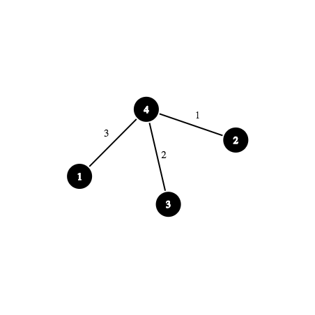
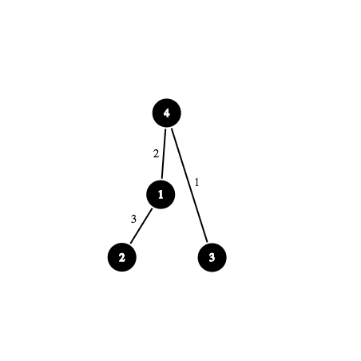

<h1 style='text-align: center;'> E. ALT</h1>

<h5 style='text-align: center;'>time limit per test: 4 seconds</h5>
<h5 style='text-align: center;'>memory limit per test: 256 megabytes</h5>

ALT is a planet in a galaxy called "Encore". Humans rule this planet but for some reason there's no dog in their planet, so the people there are sad and depressed. Rick and Morty are universal philanthropists and they want to make people in ALT happy. 

ALT has *n* cities numbered from 1 to *n* and *n* - 1 bidirectional roads numbered from 1 to *n* - 1. One can go from any city to any other city using these roads.

There are two types of people in ALT:

1. Guardians. A guardian lives in a house alongside a road and guards the road.
2. Citizens. A citizen lives in a house inside a city and works in an office in another city.

Every person on ALT is either a guardian or a citizen and there's exactly one guardian alongside each road. 

  Rick and Morty talked to all the people in ALT, and here's what they got:

* There are *m* citizens living in ALT.
* Citizen number *i* lives in city number *x**i* and works in city number *y**i*.
* Every day each citizen will go through all roads along the shortest path from his home to his work.
* A citizen will be happy if and only if either he himself has a puppy himself or all of guardians along his path to his work has a puppy (he sees the guardian's puppy in each road and will be happy).
* A guardian is always happy.

You need to tell Rick and Morty the minimum number of puppies they need in order to make all people in ALT happy, and also provide an optimal way to distribute these puppies.

## Input

The first line of input contains two integers *n* and *m* (2 ≤ *n* ≤ 2 × 104, 1 ≤ *m* ≤ 104) — number of cities and number of citizens respectively.

The next *n* - 1 lines contain the roads, *i*-th line contains endpoint of *i*-th edge, *v* and *u* (1 ≤ *v*, *u* ≤ *n*, *v* ≠ *u*).

The next *m* lines contain the information about citizens. *i*-th line contains two integers *x**i* and *y**i* (1 ≤ *x**i*, *y**i* ≤ *n*, *x**i* ≠ *y**i*).

## Output

In the first line of input print a single integer *k*, the total number of puppies they need (1 ≤ *k* ≤ *n*).

In the second line print an integer *q*, the number of puppies to give to citizens, followed by *q* distinct integers *a*1, *a*2, ..., *a**q*, index of citizens to give puppy to (0 ≤ *q* ≤ *min*(*m*, *k*), 1 ≤ *a**i* ≤ *m*).

In the third line print an integer *e*, the number of puppies to give to guardians, followed by *e* distinct integers *b*1, *b*2, ..., *b**e*, index of road of guardians to give puppy to (0 ≤ *e* ≤ *min*(*n* - 1, *k*), 1 ≤ *b**i* ≤ *n* - 1).

Sum of *q* and *e* should be equal to *k*.

## Examples

## Input


```
4 5  
2 4  
3 4  
1 4  
2 4  
2 1  
2 4  
1 2  
2 3  

```
## Output


```
3  
1 5   
2 3 1   

```
## Input


```
4 7  
3 4  
1 4  
2 1  
4 2  
4 2  
2 4  
1 4  
2 1  
3 1  
4 2  

```
## Output


```
3  
1 6   
2 2 3   

```
## Note

Map of ALT in the first sample testcase (numbers written on a road is its index):

  Map of ALT in the second sample testcase (numbers written on a road is its index): 

  

#### tags 

#3200 #data_structures #flows #graphs #trees 