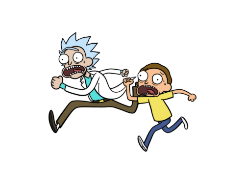

<h1 style='text-align: center;'> A. The Monster</h1>

<h5 style='text-align: center;'>time limit per test: 1 second</h5>
<h5 style='text-align: center;'>memory limit per test: 256 megabytes</h5>

A monster is chasing after Rick and Morty on another planet. They're so frightened that sometimes they scream. More accurately, Rick screams at times *b*, *b* + *a*, *b* + 2*a*, *b* + 3*a*, ... and Morty screams at times *d*, *d* + *c*, *d* + 2*c*, *d* + 3*c*, .... 

  The Monster will catch them if at any point they scream at the same time, so it wants to know when it will catch them (the first time they scream at the same time) or that they will never scream at the same time.

## Input

The first line of input contains two integers *a* and *b* (1 ≤ *a*, *b* ≤ 100). 

The second line contains two integers *c* and *d* (1 ≤ *c*, *d* ≤ 100).

## Output

Print the first time Rick and Morty will scream at the same time, or  - 1 if they will never scream at the same time.

## Examples

## Input


```
20 2  
9 19  

```
## Output


```
82  

```
## Input


```
2 1  
16 12  

```
## Output


```
-1  

```
## Note

In the first sample testcase, Rick's 5th scream and Morty's 8th time are at time 82. 

In the second sample testcase, all Rick's screams will be at odd times and Morty's will be at even times, so they will never scream at the same time.


#### tags 

#1200 #brute_force #math #number_theory 