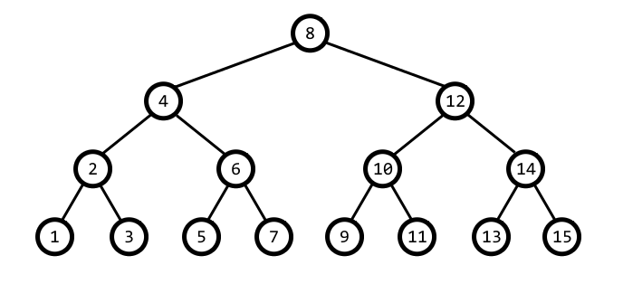

<h1 style='text-align: center;'> D. Paths in a Complete Binary Tree</h1>

<h5 style='text-align: center;'>time limit per test: 3 seconds</h5>
<h5 style='text-align: center;'>memory limit per test: 256 megabytes</h5>

*T* is a complete binary tree consisting of *n* vertices. It means that exactly one vertex is a root, and each vertex is either a leaf (and doesn't have children) or an inner node (and has exactly two children). All leaves of a complete binary tree have the same depth (distance from the root). So *n* is a number such that *n* + 1 is a power of 2.

In the picture you can see a complete binary tree with *n* = 15.

  Vertices are numbered from 1 to *n* in a special recursive way: we recursively assign numbers to all vertices from the left subtree (if current vertex is not a leaf), then assign a number to the current vertex, and then recursively assign numbers to all vertices from the right subtree (if it exists). In the picture vertices are numbered exactly using this algorithm. It is clear that for each size of a complete binary tree exists exactly one way to give numbers to all vertices. This way of numbering is called symmetric.

You have to write a program that for given *n* answers *q* queries to the tree.

Each query consists of an integer number *u**i* (1 ≤ *u**i* ≤ *n*) and a string *s**i*, where *u**i* is the number of vertex, and *s**i* represents the path starting from this vertex. String *s**i* doesn't contain any characters other than 'L', 'R' and 'U', which mean traverse to the left child, to the right child and to the parent, respectively. Characters from *s**i* have to be processed from left to right, considering that *u**i* is the vertex where the path starts. If it's impossible to process a character (for example, to go to the left child of a leaf), then you have to skip it. The answer is the number of vertex where the path represented by *s**i* ends.

For example, if *u**i* = 4 and *s**i* = «UURL», then the answer is 10.

## Input

The first line contains two integer numbers *n* and *q* (1 ≤ *n* ≤ 1018, *q* ≥ 1). *n* is such that *n* + 1 is a power of 2.

The next 2*q* lines represent queries; each query consists of two consecutive lines. The first of these two lines contains *u**i* (1 ≤ *u**i* ≤ *n*), the second contains non-empty string *s**i*. *s**i* doesn't contain any characters other than 'L', 'R' and 'U'.

It is guaranteed that the sum of lengths of *s**i* (for each *i* such that 1 ≤ *i* ≤ *q*) doesn't exceed 105.

## Output

Print *q* numbers, *i*-th number must be the answer to the *i*-th query.

## Example

## Input


```
15 2  
4  
UURL  
8  
LRLLLLLLLL  

```
## Output


```
10  
5  

```


#### tags 

#1900 #bitmasks #trees 