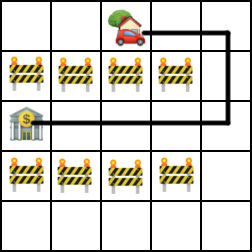
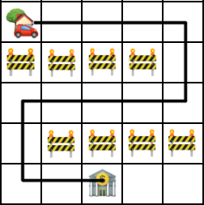

<h1 style='text-align: center;'> B. Igor and his way to work</h1>

<h5 style='text-align: center;'>time limit per test: 3 seconds</h5>
<h5 style='text-align: center;'>memory limit per test: 256 megabytes</h5>

Woken up by the alarm clock Igor the financial analyst hurried up to the work. He ate his breakfast and sat in his car. Sadly, when he opened his GPS navigator, he found that some of the roads in Bankopolis, the city where he lives, are closed due to road works. Moreover, Igor has some problems with the steering wheel, so he can make no more than two turns on his way to his office in bank.

Bankopolis looks like a grid of *n* rows and *m* columns. Igor should find a way from his home to the bank that has no more than two turns and doesn't contain cells with road works, or determine that it is impossible and he should work from home. A turn is a change in movement direction. Igor's car can only move to the left, to the right, upwards and downwards. Initially Igor can choose any direction. Igor is still sleepy, so you should help him.

## Input

The first line contains two integers *n* and *m* (1 ≤ *n*, *m* ≤ 1000) — the number of rows and the number of columns in the grid.

Each of the next *n* lines contains *m* characters denoting the corresponding row of the grid. The following characters can occur: 

* "." — an empty cell;
* "*" — a cell with road works;
* "S" — the cell where Igor's home is located;
* "T" — the cell where Igor's office is located.

It is guaranteed that "S" and "T" appear exactly once each.

## Output

In the only line print "YES" if there is a path between Igor's home and Igor's office with no more than two turns, and "NO" otherwise.

## Examples

## Input


```
5 5  
..S..  
****.  
T....  
****.  
.....  

```
## Output


```
YES
```
## Input


```
5 5  
S....  
****.  
.....  
.****  
..T..  

```
## Output


```
NO
```
## Note

The first sample is shown on the following picture:

  In the second sample it is impossible to reach Igor's office using less that 4 turns, thus there exists no path using no more than 2 turns. The path using exactly 4 turns is shown on this picture:

  

#### tags 

#1600 #dfs_and_similar #graphs #implementation #shortest_paths 