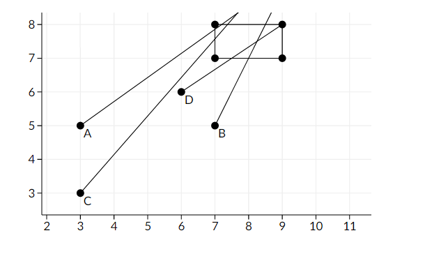
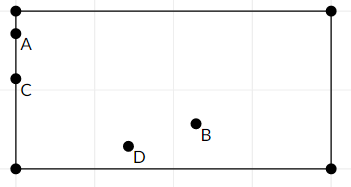
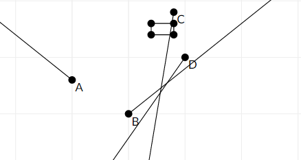

<h1 style='text-align: center;'> C. Mice problem</h1>

<h5 style='text-align: center;'>time limit per test: 2 seconds</h5>
<h5 style='text-align: center;'>memory limit per test: 256 megabytes</h5>

Igor the analyst fell asleep on the work and had a strange dream. In the dream his desk was crowded with computer mice, so he bought a mousetrap to catch them.

The desk can be considered as an infinite plane, then the mousetrap is a rectangle which sides are parallel to the axes, and which opposite sides are located in points (*x*1, *y*1) and (*x*2, *y*2).

Igor wants to catch all mice. Igor has analysed their behavior and discovered that each mouse is moving along a straight line with constant speed, the speed of the *i*-th mouse is equal to (*v**i**x*, *v**i**y*), that means that the *x* coordinate of the mouse increases by *v**i**x* units per second, while the *y* coordinates increases by *v**i**y* units. The mousetrap is open initially so that the mice are able to move freely on the desk. Igor can close the mousetrap at any moment catching all the mice that are strictly inside the mousetrap.

Igor works a lot, so he is busy in the dream as well, and he asks you to write a program that by given mousetrap's coordinates, the initial coordinates of the mice and their speeds determines the earliest time moment in which he is able to catch all the mice. Please note that Igor can close the mousetrap only once.

## Input

The first line contains single integer *n* (1 ≤ *n* ≤ 100 000) — the number of computer mice on the desk.

The second line contains four integers *x*1, *y*1, *x*2 and *y*2 (0 ≤ *x*1 ≤ *x*2 ≤ 100 000), (0 ≤ *y*1 ≤ *y*2 ≤ 100 000) — the coordinates of the opposite corners of the mousetrap.

The next *n* lines contain the information about mice.

The *i*-th of these lines contains four integers *r**i**x*, *r**i**y*, *v**i**x* and *v**i**y*, (0 ≤ *r**i**x*, *r**i**y* ≤ 100 000,  - 100 000 ≤ *v**i**x*, *v**i**y* ≤ 100 000), where (*r**i**x*, *r**i**y*) is the initial position of the mouse, and (*v**i**x*, *v**i**y*) is its speed.

## Output

In the only line print minimum possible non-negative number *t* such that if Igor closes the mousetrap at *t* seconds from the beginning, then all the mice are strictly inside the mousetrap. If there is no such *t*, print -1.

Your answer is considered correct if its absolute or relative error doesn't exceed 10- 6. 

Formally, let your answer be *a*, and the jury's answer be *b*. Your answer is considered correct if .

## Examples

## Input


```
4  
7 7 9 8  
3 5 7 5  
7 5 2 4  
3 3 7 8  
6 6 3 2  

```
## Output


```
0.57142857142857139685  

```
## Input


```
4  
7 7 9 8  
0 3 -5 4  
5 0 5 4  
9 9 -1 -6  
10 5 -7 -10  

```
## Output


```
-1  

```
## Note

Here is a picture of the first sample

Points A, B, C, D - start mice positions, segments are their paths.



Then, at first time when all mice will be in rectangle it will be looks like this:



Here is a picture of the second sample



Points A, D, B will never enter rectangle.


#### tags 

#2300 #geometry #implementation #math #sortings 