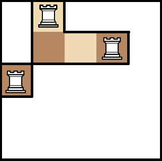

<h1 style='text-align: center;'> G. Oleg and chess</h1>

<h5 style='text-align: center;'>time limit per test: 6.5 seconds</h5>
<h5 style='text-align: center;'>memory limit per test: 256 megabytes</h5>

Oleg the bank client solves an interesting chess problem: place on *n* × *n* chessboard the maximum number of rooks so that they don't beat each other. Of course, no two rooks can share the same cell.

Remind that a rook standing in the cell (*a*, *b*) beats a rook standing in the cell (*x*, *y*) if and only if *a* = *x* or *b* = *y*.

Unfortunately (of fortunately?) for Oleg the answer in this problem was always *n*, so the task bored Oleg soon. He decided to make it more difficult by removing some cells from the board. If a cell is deleted, Oleg can't put a rook there, but rooks do beat each other "through" deleted cells.

Oleg deletes the cells in groups, namely, he repeatedly choose a rectangle with sides parallel to the board sides and deletes all the cells inside the rectangle. Formally, if he chooses a rectangle, lower left cell of which has coordinates (*x*1, *y*1), and upper right cell of which has coordinates (*x*2, *y*2), then he deletes all such cells with coordinates (*x*, *y*) that *x*1 ≤ *x* ≤ *x*2 and *y*1 ≤ *y* ≤ *y*2. It is guaranteed that no cell is deleted twice, i.e. the chosen rectangles do not intersect.

This version of the problem Oleg can't solve, and his friend Igor is busy at a conference, so he can't help Oleg.

You are the last hope for Oleg! Help him: given the size of the board and the deleted rectangles find the maximum possible number of rooks that could be placed on the board so that no two rooks beat each other.

## Input

The first line contains single integer *n* (1  ≤  *n* ≤  10000) — the size of the board.

The second line contains single integer *q* (0  ≤  *q*  ≤  10000) — the number of deleted rectangles.

The next *q* lines contain the information about the deleted rectangles.

Each of these lines contains four integers *x*1, *y*1, *x*2 and *y*2 (1  ≤ *x*1 ≤ *x*2 ≤ *n*, 1  ≤ *y*1 ≤ *y*2 ≤ *n*) — the coordinates of the lower left and the upper right cells of a deleted rectangle.

If is guaranteed that the rectangles do not intersect.

## Output

In the only line print the maximum number of rooks Oleg can place on the board so that no two rooks beat each other.

## Examples

## Input


```
5  
5  
1 1 2 1  
1 3 1 5  
4 1 5 5  
2 5 2 5  
3 2 3 5  

```
## Output


```
3  

```
## Input


```
8  
4  
2 2 4 6  
1 8 1 8  
7 1 8 2  
5 4 6 8  

```
## Output


```
8  

```
## Note

Here is the board and the example of rooks placement in the first example:




#### tags 

#3400 #data_structures #divide_and_conquer #flows #graph_matchings 