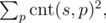
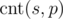

<h1 style='text-align: center;'> I. Fake News (hard)</h1>

<h5 style='text-align: center;'>time limit per test: 5 seconds</h5>
<h5 style='text-align: center;'>memory limit per test: 256 megabytes</h5>

Now that you have proposed a fake post for the HC2 Facebook page, Heidi wants to measure the quality of the post before actually posting it. She recently came across a (possibly fake) article about the impact of fractal structure on multimedia messages and she is now trying to measure the self-similarity of the message, which is defined as

where the sum is over all nonempty strings *p* and  is the number of occurences of *p* in *s* as a substring. (## Note

 that the sum is infinite, but it only has a finite number of nonzero summands.)

Heidi refuses to do anything else until she knows how to calculate this self-similarity. Could you please help her? (If you would like to instead convince Heidi that a finite string cannot be a fractal anyway – do not bother, we have already tried.)

## Input

The input starts with a line indicating the number of test cases *T* (1 ≤ *T* ≤ 10). After that, *T* test cases follow, each of which consists of one line containing a string *s* (1 ≤ |*s*| ≤ 100 000) composed of lowercase letters (a-z).

## Output

## Output

 *T* lines, every line containing one number – the answer to the corresponding test case.

## Example

## Input


```
4  
aa  
abcd  
ccc  
abcc  

```
## Output


```
5  
10  
14  
12  

```
## Note

A string *s* contains another string *p* as a substring if *p* is a contiguous subsequence of *s*. For example, ab is a substring of cab but not of acb.


#### tags 

#2300 #string_suffix_structures 