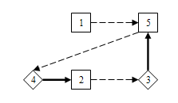

<h1 style='text-align: center;'> E. Pairs</h1>

<h5 style='text-align: center;'>time limit per test: 1 second</h5>
<h5 style='text-align: center;'>memory limit per test: 256 megabytes</h5>

There are *n* students in Polycarp's class (including himself). A few days ago all students wrote an essay "My best friend". Each student's essay was dedicated to one of the students of class, to his/her best friend. ## Note

 that student *b*'s best friend is not necessarily student *a*, if *a*'s best friend is *b*.

And now the teacher leads the whole class to the museum of the history of sports programming. Exciting stories of legendary heroes await the students: tourist, Petr, tomek, SnapDragon — that's who they will hear about!

The teacher decided to divide students into pairs so that each pair consisted of a student and his best friend. She may not be able to split all the students into pairs, it's not a problem — she wants to pick out the maximum number of such pairs. If there is more than one variant of doing so, she wants to pick out the pairs so that there were as much boy-girl pairs as possible. Of course, each student must not be included in more than one pair.

## Input

The first line contains an integer *n* (2 ≤ *n* ≤ 105), *n* is the number of students per class. Next, *n* lines contain information about the students, one per line. Each line contains two integers *f**i*, *s**i* (1 ≤ *f**i* ≤ *n*, *f**i* ≠ *i*, 1 ≤ *s**i* ≤ 2), where *f**i* is the number of *i*-th student's best friend and *s**i* denotes the *i*-th pupil's sex (*s**i* = 1 for a boy and *s**i* = 2 for a girl).

## Output

Print on the first line two numbers *t*, *e*, where *t* is the maximum number of formed pairs, and *e* is the maximum number of boy-girl type pairs among them. Then print *t* lines, each line must contain a pair *a**i*, *b**i* (1 ≤ *a**i*, *b**i* ≤ *n*), they are numbers of pupils in the *i*-th pair. Print the pairs in any order. Print the numbers in pairs in any order. If there are several solutions, output any of them.

## Examples

## Input


```
5  
5 2  
3 2  
5 1  
2 1  
4 2  

```
## Output


```
2 2  
5 3  
4 2  

```
## Input


```
6  
5 2  
3 2  
5 1  
2 1  
4 2  
3 1  

```
## Output


```
3 1  
4 2  
5 1  
3 6  

```
## Input


```
8  
2 2  
3 2  
5 1  
3 1  
6 1  
5 1  
8 2  
7 1  

```
## Output


```
4 1  
5 6  
3 4  
2 1  
7 8  

```
## Note

The picture corresponds to the first sample. On the picture rhomb stand for boys, squares stand for girls, arrows lead from a pupil to his/her best friend. Bold non-dashed arrows stand for pairs in the answer. 

  

#### tags 

#2700 #dfs_and_similar #dp #dsu #graphs #implementation #trees 