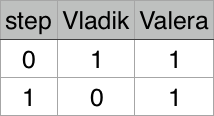
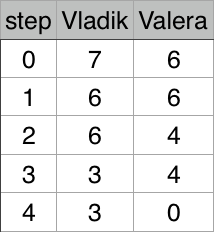

<h1 style='text-align: center;'> A. Vladik and Courtesy</h1>

<h5 style='text-align: center;'>time limit per test: 2 seconds</h5>
<h5 style='text-align: center;'>memory limit per test: 256 megabytes</h5>

At regular competition Vladik and Valera won *a* and *b* candies respectively. Vladik offered 1 his candy to Valera. After that Valera gave Vladik 2 his candies, so that no one thought that he was less generous. Vladik for same reason gave 3 candies to Valera in next turn.

More formally, the guys take turns giving each other one candy more than they received in the previous turn.

This continued until the moment when one of them couldn’t give the right amount of candy. Candies, which guys got from each other, they don’t consider as their own. You need to know, who is the first who can’t give the right amount of candy.

## Input

Single line of input data contains two space-separated integers *a*, *b* (1 ≤ *a*, *b* ≤ 109) — number of Vladik and Valera candies respectively.

## Output

Pring a single line "Vladik’’ in case, if Vladik first who can’t give right amount of candy, or "Valera’’ otherwise.

## Examples

## Input


```
1 1  

```
## Output


```
Valera  

```
## Input


```
7 6  

```
## Output


```
Vladik  

```
## Note

Illustration for first test case:



Illustration for second test case:




#### tags 

#800 #brute_force #implementation 