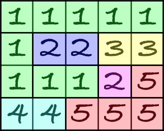
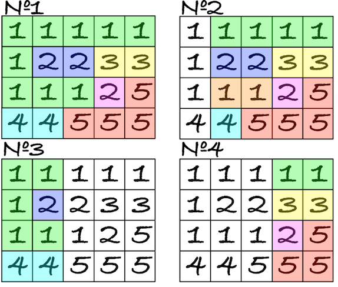

<h1 style='text-align: center;'> E. Vladik and Entertaining Flags</h1>

<h5 style='text-align: center;'>time limit per test: 2 seconds</h5>
<h5 style='text-align: center;'>memory limit per test: 256 megabytes</h5>

In his spare time Vladik estimates beauty of the flags.

Every flag could be represented as the matrix *n* × *m* which consists of positive integers.

Let's define the beauty of the flag as number of components in its matrix. We call component a set of cells with same numbers and between any pair of cells from that set there exists a path through adjacent cells from same component. Here is the example of the partitioning some flag matrix into components:

  But this time he decided to change something in the process. Now he wants to estimate not the entire flag, but some segment. Segment of flag can be described as a submatrix of the flag matrix with opposite corners at (1, *l*) and (*n*, *r*), where conditions 1 ≤ *l* ≤ *r* ≤ *m* are satisfied.

Help Vladik to calculate the beauty for some segments of the given flag.

## Input

First line contains three space-separated integers *n*, *m*, *q* (1 ≤ *n* ≤ 10, 1 ≤ *m*, *q* ≤ 105) — dimensions of flag matrix and number of segments respectively.

Each of next *n* lines contains *m* space-separated integers — description of flag matrix. All elements of flag matrix is positive integers not exceeding 106.

Each of next *q* lines contains two space-separated integers *l*, *r* (1 ≤ *l* ≤ *r* ≤ *m*) — borders of segment which beauty Vladik wants to know.

## Output

For each segment print the result on the corresponding line.

## Example

## Input


```
4 5 4  
1 1 1 1 1  
1 2 2 3 3  
1 1 1 2 5  
4 4 5 5 5  
1 5  
2 5  
1 2  
4 5  

```
## Output


```
6  
7  
3  
4  

```
## Note

Partitioning on components for every segment from first test case:




#### tags 

#2600 #data_structures #dsu #graphs 