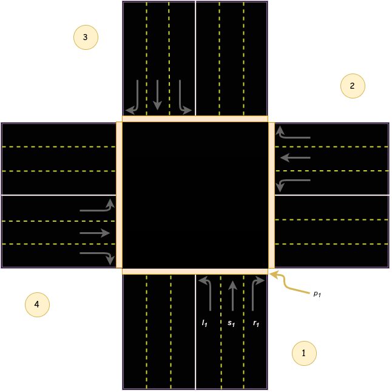

<h1 style='text-align: center;'> A. Sagheer and Crossroads</h1>

<h5 style='text-align: center;'>time limit per test: 1 second</h5>
<h5 style='text-align: center;'>memory limit per test: 256 megabytes</h5>

Sagheer is walking in the street when he comes to an intersection of two roads. Each road can be represented as two parts where each part has 3 lanes getting into the intersection (one for each direction) and 3 lanes getting out of the intersection, so we have 4 parts in total. Each part has 4 lights, one for each lane getting into the intersection (*l* — left, *s* — straight, *r* — right) and a light *p* for a pedestrian crossing. 

  An accident is possible if a car can hit a pedestrian. This can happen if the light of a pedestrian crossing of some part and the light of a lane that can get to or from that same part are green at the same time.

Now, Sagheer is monitoring the configuration of the traffic lights. Your task is to help him detect whether an accident is possible.

## Input

The input consists of four lines with each line describing a road part given in a counter-clockwise order.

Each line contains four integers *l*, *s*, *r*, *p* — for the left, straight, right and pedestrian lights, respectively. The possible values are 0 for red light and 1 for green light.

## Output

On a single line, print "YES" if an accident is possible, and "NO" otherwise.

## Examples

## Input


```
1 0 0 1  
0 1 0 0  
0 0 1 0  
0 0 0 1  

```
## Output


```
YES  

```
## Input


```
0 1 1 0  
1 0 1 0  
1 1 0 0  
0 0 0 1  

```
## Output


```
NO  

```
## Input


```
1 0 0 0  
0 0 0 1  
0 0 0 0  
1 0 1 0  

```
## Output


```
NO  

```
## Note

In the first example, some accidents are possible because cars of part 1 can hit pedestrians of parts 1 and 4. Also, cars of parts 2 and 3 can hit pedestrians of part 4.

In the second example, no car can pass the pedestrian crossing of part 4 which is the only green pedestrian light. So, no accident can occur.


#### tags 

#1200 #implementation 