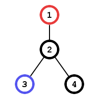
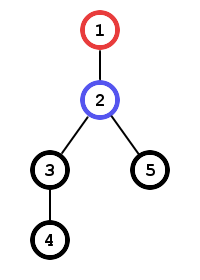

<h1 style='text-align: center;'> C. The Tag Game</h1>

<h5 style='text-align: center;'>time limit per test: 1 second</h5>
<h5 style='text-align: center;'>memory limit per test: 256 megabytes</h5>

Alice got tired of playing the tag game by the usual rules so she offered Bob a little modification to it. Now the game should be played on an undirected rooted tree of *n* vertices. Vertex 1 is the root of the tree.

Alice starts at vertex 1 and Bob starts at vertex *x* (*x* ≠ 1). The moves are made in turns, Bob goes first. In one move one can either stay at the current vertex or travel to the neighbouring one.

The game ends when Alice goes to the same vertex where Bob is standing. Alice wants to minimize the total number of moves and Bob wants to maximize it.

You should write a program which will determine how many moves will the game last.

## Input

The first line contains two integer numbers *n* and *x* (2 ≤ *n* ≤ 2·105, 2 ≤ *x* ≤ *n*).

Each of the next *n* - 1 lines contains two integer numbers *a* and *b* (1 ≤ *a*, *b* ≤ *n*) — edges of the tree. It is guaranteed that the edges form a valid tree.

## Output

Print the total number of moves Alice and Bob will make.

## Examples

## Input


```
4 3  
1 2  
2 3  
2 4  

```
## Output


```
4  

```
## Input


```
5 2  
1 2  
2 3  
3 4  
2 5  

```
## Output


```
6  

```
## Note

In the first example the tree looks like this:

  The red vertex is Alice's starting position, the blue one is Bob's. Bob will make the game run the longest by standing at the vertex 3 during all the game. So here are the moves:

B: stay at vertex 3

A: go to vertex 2

B: stay at vertex 3

A: go to vertex 3

In the second example the tree looks like this:

  The moves in the optimal strategy are:

B: go to vertex 3

A: go to vertex 2

B: go to vertex 4

A: go to vertex 3

B: stay at vertex 4

A: go to vertex 4


#### tags 

#1700 #dfs_and_similar #graphs 