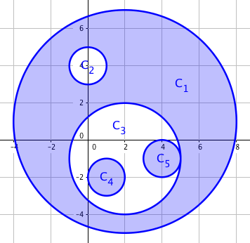
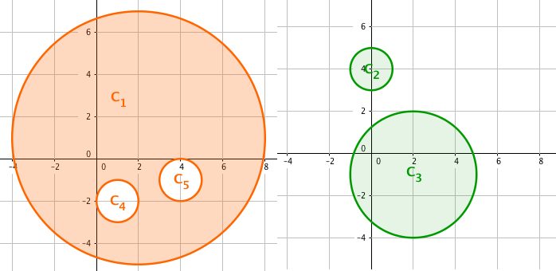

<h1 style='text-align: center;'> D. An overnight dance in discotheque</h1>

<h5 style='text-align: center;'>time limit per test: 2 seconds</h5>
<h5 style='text-align: center;'>memory limit per test: 256 megabytes</h5>

The crowdedness of the discotheque would never stop our friends from having fun, but a bit more spaciousness won't hurt, will it?

The discotheque can be seen as an infinite *xy*-plane, in which there are a total of *n* dancers. Once someone starts moving around, they will move only inside their own movement range, which is a circular area *C**i* described by a center (*x**i*, *y**i*) and a radius *r**i*. No two ranges' borders have more than one common point, that is for every pair (*i*, *j*) (1 ≤ *i* < *j* ≤ *n*) either ranges *C**i* and *C**j* are disjoint, or one of them is a subset of the other. ## Note

 that it's possible that two ranges' borders share a single common point, but no two dancers have exactly the same ranges.

Tsukihi, being one of them, defines the spaciousness to be the area covered by an odd number of movement ranges of dancers who are moving. An example is shown below, with shaded regions representing the spaciousness if everyone moves at the same time.

  But no one keeps moving for the whole night after all, so the whole night's time is divided into two halves — before midnight and after midnight. Every dancer moves around in one half, while sitting down with friends in the other. The spaciousness of two halves are calculated separately and their sum should, of course, be as large as possible. The following figure shows an optimal solution to the example above.

  By different plans of who dances in the first half and who does in the other, different sums of spaciousness over two halves are achieved. You are to find the largest achievable value of this sum.

## Input

The first line of input contains a positive integer *n* (1 ≤ *n* ≤ 1 000) — the number of dancers.

The following *n* lines each describes a dancer: the *i*-th line among them contains three space-separated integers *x**i*, *y**i* and *r**i* ( - 106 ≤ *x**i*, *y**i* ≤ 106, 1 ≤ *r**i* ≤ 106), describing a circular movement range centered at (*x**i*, *y**i*) with radius *r**i*.

## Output

## Output

 one decimal number — the largest achievable sum of spaciousness over two halves of the night.

The output is considered correct if it has a relative or absolute error of at most 10- 9. Formally, let your answer be *a*, and the jury's answer be *b*. Your answer is considered correct if .

## Examples

## Input


```
5  
2 1 6  
0 4 1  
2 -1 3  
1 -2 1  
4 -1 1  

```
## Output


```
138.23007676  

```
## Input


```
8  
0 0 1  
0 0 2  
0 0 3  
0 0 4  
0 0 5  
0 0 6  
0 0 7  
0 0 8  

```
## Output


```
289.02652413  

```
## Note

The first sample corresponds to the illustrations in the legend.


#### tags 

#2000 #dfs_and_similar #dp #geometry #greedy #trees 