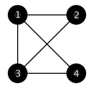
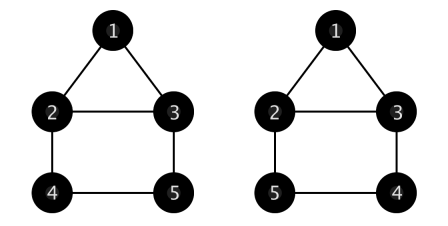

<h1 style='text-align: center;'> E. An unavoidable detour for home</h1>

<h5 style='text-align: center;'>time limit per test: 3 seconds</h5>
<h5 style='text-align: center;'>memory limit per test: 256 megabytes</h5>

Those unwilling to return home from a long journey, will be affected by the oddity of the snail and lose their way. Mayoi, the oddity's carrier, wouldn't like this to happen, but there's nothing to do with this before a cure is figured out. For now, she would only like to know the enormous number of possibilities to be faced with if someone gets lost.

There are *n* towns in the region, numbered from 1 to *n*. The town numbered 1 is called the capital. The traffic network is formed by bidirectional roads connecting pairs of towns. No two roads connect the same pair of towns, and no road connects a town with itself. The time needed to travel through each of the roads is the same. Lost travelers will not be able to find out how the towns are connected, but the residents can help them by providing the following facts: 

* Starting from each town other than the capital, the shortest path (i.e. the path passing through the minimum number of roads) to the capital exists, and is unique;
* Let *l**i* be the number of roads on the shortest path from town *i* to the capital, then *l**i* ≥ *l**i* - 1 holds for all 2 ≤ *i* ≤ *n*;
* For town *i*, the number of roads connected to it is denoted by *d**i*, which equals either 2 or 3.

You are to count the number of different ways in which the towns are connected, and give the answer modulo 109 + 7. Two ways of connecting towns are considered different if a pair (*u*, *v*) (1 ≤ *u*, *v* ≤ *n*) exists such there is a road between towns *u* and *v* in one of them but not in the other.

## Input

The first line of input contains a positive integer *n* (3 ≤ *n* ≤ 50) — the number of towns.

The second line contains *n* space-separated integers *d*1, *d*2, ..., *d**n* (2 ≤ *d**i* ≤ 3) — the number of roads connected to towns 1, 2, ..., *n*, respectively. It is guaranteed that the sum of *d**i* over all *i* is even.

## Output

## Output

 one integer — the total number of different possible ways in which the towns are connected, modulo 109 + 7.

## Examples

## Input


```
4  
3 2 3 2  

```
## Output


```
1  

```
## Input


```
5  
2 3 3 2 2  

```
## Output


```
2  

```
## Input


```
5  
2 2 2 2 2  

```
## Output


```
2  

```
## Input


```
20  
2 2 2 2 3 2 3 2 2 2 2 2 2 2 2 2 2 3 3 2  

```
## Output


```
82944  

```
## Note

In the first example, the following structure is the only one to satisfy the constraints, the distances from towns 2, 3, 4 to the capital are all 1.

  In the second example, the following two structures satisfy the constraints.

  

#### tags 

#2600 #combinatorics #dp #graphs #shortest_paths 