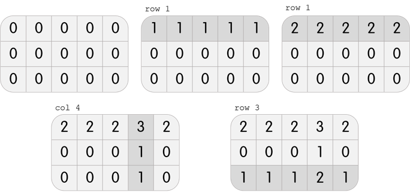
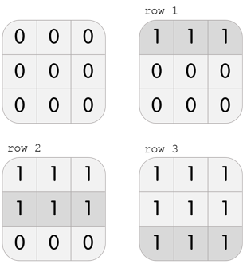

<h1 style='text-align: center;'> A. Karen and Game</h1>

<h5 style='text-align: center;'>time limit per test: 2 seconds</h5>
<h5 style='text-align: center;'>memory limit per test: 512 megabytes</h5>

On the way to school, Karen became fixated on the puzzle game on her phone!

  The game is played as follows. In each level, you have a grid with *n* rows and *m* columns. Each cell originally contains the number 0.

One move consists of choosing one row or column, and adding 1 to all of the cells in that row or column.

To win the level, after all the moves, the number in the cell at the *i*-th row and *j*-th column should be equal to *g**i*, *j*.

Karen is stuck on one level, and wants to know a way to beat this level using the minimum number of moves. Please, help her with this task!

## Input

The first line of input contains two integers, *n* and *m* (1 ≤ *n*, *m* ≤ 100), the number of rows and the number of columns in the grid, respectively.

The next *n* lines each contain *m* integers. In particular, the *j*-th integer in the *i*-th of these rows contains *g**i*, *j* (0 ≤ *g**i*, *j* ≤ 500).

## Output

If there is an error and it is actually not possible to beat the level, output a single integer -1.

Otherwise, on the first line, output a single integer *k*, the minimum number of moves necessary to beat the level.

The next *k* lines should each contain one of the following, describing the moves in the order they must be done:

* row *x*, (1 ≤ *x* ≤ *n*) describing a move of the form "choose the *x*-th row".
* col *x*, (1 ≤ *x* ≤ *m*) describing a move of the form "choose the *x*-th column".

If there are multiple optimal solutions, output any one of them.

## Examples

## Input


```
3 5  
2 2 2 3 2  
0 0 0 1 0  
1 1 1 2 1  

```
## Output


```
4  
row 1  
row 1  
col 4  
row 3  

```
## Input


```
3 3  
0 0 0  
0 1 0  
0 0 0  

```
## Output


```
-1  

```
## Input


```
3 3  
1 1 1  
1 1 1  
1 1 1  

```
## Output


```
3  
row 1  
row 2  
row 3  

```
## Note

In the first test case, Karen has a grid with 3 rows and 5 columns. She can perform the following 4 moves to beat the level:

  In the second test case, Karen has a grid with 3 rows and 3 columns. It is clear that it is impossible to beat the level; performing any move will create three 1s on the grid, but it is required to only have one 1 in the center.

In the third test case, Karen has a grid with 3 rows and 3 columns. She can perform the following 3 moves to beat the level:

  ## Note

 that this is not the only solution; another solution, among others, is col 1, col 2, col 3.


#### tags 

#1700 #brute_force #greedy #implementation 