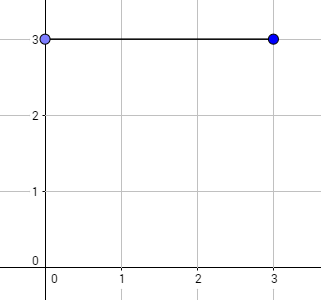
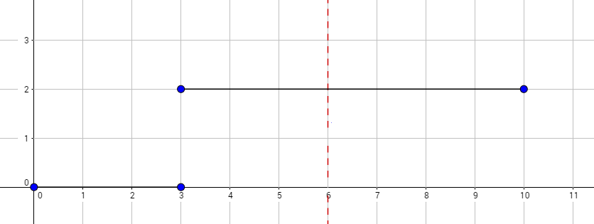

<h1 style='text-align: center;'> E. Okabe and El Psy Kongroo</h1>

<h5 style='text-align: center;'>time limit per test: 2 seconds</h5>
<h5 style='text-align: center;'>memory limit per test: 256 megabytes</h5>

Okabe likes to take walks but knows that spies from the Organization could be anywhere; that's why he wants to know how many different walks he can take in his city safely. Okabe's city can be represented as all points (*x*, *y*) such that *x* and *y* are non-negative. Okabe starts at the origin (point (0, 0)), and needs to reach the point (*k*, 0). If Okabe is currently at the point (*x*, *y*), in one step he can go to (*x* + 1, *y* + 1), (*x* + 1, *y*), or (*x* + 1, *y* - 1).

Additionally, there are *n* horizontal line segments, the *i*-th of which goes from *x* = *a**i* to *x* = *b**i* inclusive, and is at *y* = *c**i*. It is guaranteed that *a*1 = 0, *a**n* ≤ *k* ≤ *b**n*, and *a**i* = *b**i* - 1 for 2 ≤ *i* ≤ *n*. The *i*-th line segment forces Okabe to walk with *y*-value in the range 0 ≤ *y* ≤ *c**i* when his *x* value satisfies *a**i* ≤ *x* ≤ *b**i*, or else he might be spied on. This also means he is required to be under two line segments when one segment ends and another begins.

Okabe now wants to know how many walks there are from the origin to the point (*k*, 0) satisfying these conditions, modulo 109 + 7.

## Input

The first line of input contains the integers *n* and *k* (1 ≤ *n* ≤ 100, 1 ≤ *k* ≤ 1018) — the number of segments and the destination *x* coordinate.

The next *n* lines contain three space-separated integers *a**i*, *b**i*, and *c**i* (0 ≤ *a**i* < *b**i* ≤ 1018, 0 ≤ *c**i* ≤ 15) — the left and right ends of a segment, and its *y* coordinate.

It is guaranteed that *a*1 = 0, *a**n* ≤ *k* ≤ *b**n*, and *a**i* = *b**i* - 1 for 2 ≤ *i* ≤ *n*.

## Output

Print the number of walks satisfying the conditions, modulo 1000000007 (109 + 7).

## Examples

## Input


```
1 3  
0 3 3  

```
## Output


```
4  

```
## Input


```
2 6  
0 3 0  
3 10 2  

```
## Output


```
4  

```
## Note

  The graph above corresponds to sample 1. The possible walks are:

* 
* 
* 
* 

  The graph above corresponds to sample 2. There is only one walk for Okabe to reach (3, 0). After this, the possible walks are:

* 
* 
* 
* 


#### tags 

#2100 #dp #matrices 