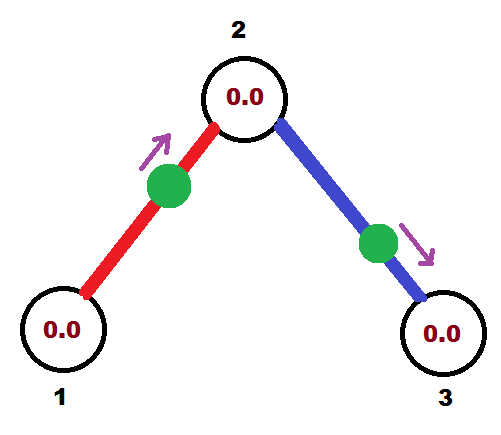
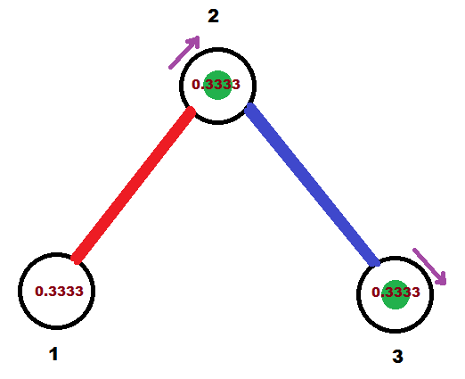
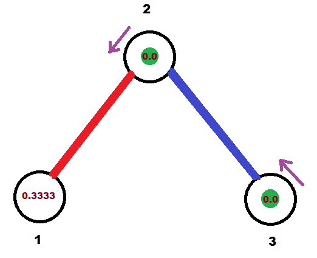
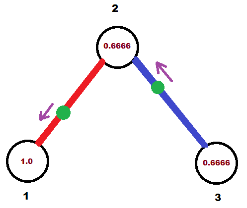
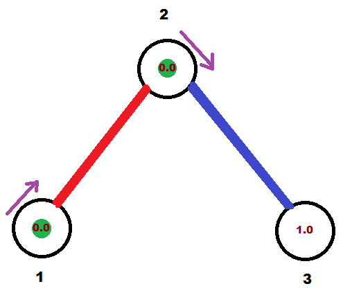
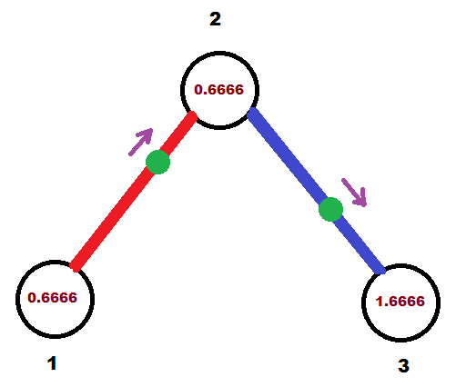

<h1 style='text-align: center;'> F. Madness</h1>

<h5 style='text-align: center;'>time limit per test: 2 seconds</h5>
<h5 style='text-align: center;'>memory limit per test: 256 megabytes</h5>

The second semester starts at the University of Pavlopolis. After vacation in Vičkopolis Noora needs to return to Pavlopolis and continue her study.

Sometimes (or quite often) there are teachers who do not like you. Incidentally Noora also has one such teacher. His name is Yury Dmitrievich and he teaches graph theory. Yury Dmitrievich doesn't like Noora, so he always gives the girl the most difficult tasks. So it happened this time.

The teacher gives Noora a tree with *n* vertices. Vertices are numbered with integers from 1 to *n*. The length of all the edges of this tree is 1. Noora chooses a set of simple paths that pairwise don't intersect in edges. However each vertex should belong to at least one of the selected path.

For each of the selected paths, the following is done:

1. We choose exactly one edge (*u*, *v*) that belongs to the path.
2. On the selected edge (*u*, *v*) there is a point at some selected distance *x* from the vertex *u* and at distance 1 - *x* from vertex *v*. But the distance *x* chosen by Noora arbitrarily, i. e. it can be different for different edges.
3. One of the vertices *u* or *v* is selected. The point will start moving to the selected vertex.

Let us explain how the point moves by example. Suppose that the path consists of two edges (*v*1, *v*2) and (*v*2, *v*3), the point initially stands on the edge (*v*1, *v*2) and begins its movement to the vertex *v*1. Then the point will reach *v*1, then "turn around", because the end of the path was reached, further it will move in another direction to vertex *v*2, then to vertex *v*3, then "turn around" again, then move to *v*2 and so on. The speed of the points is 1 edge per second. For example, for 0.5 second the point moves to the length of the half of an edge.

A stopwatch is placed at each vertex of the tree. The time that the stopwatches indicate at start time is 0 seconds. Then at the starting moment of time, all points simultaneously start moving from the selected positions to selected directions along the selected paths, and stopwatches are simultaneously started. When one of the points reaches the vertex *v*, the stopwatch at the vertex *v* is automatically reset, i.e. it starts counting the time from zero.

Denote by *res**v* the maximal time that the stopwatch at the vertex *v* will show if the point movement continues infinitely. Noora is asked to select paths and points on them so that *res*1 is as minimal as possible. If there are several solutions to do this, it is necessary to minimize *res*2, then *res*3, *res*4, ..., *res**n*.

Help Noora complete the teacher's task.

For the better understanding of the statement, see the explanation for the example.

## Input

The first line contains single integer *n* (2 ≤ *n* ≤ 100) — number of vertices in the given tree.

Each of next *n* - 1 lines contains two integers *u* and *v* (1 ≤ *u*, *v* ≤ *n*, *u* ≠ *v*) — vertices connected by an edge.

Guaranteed that input defines a valid tree.

## Output

In the first line print single integer *paths* — number of paths you want to choose.

In the next *paths* lines print path's descriptions:

1. Single integer *len* — number of edges in the current path.
2. *len* integers — indices of the edges in the path. The edges are numbered from 1 to *n* - 1 in order they are given in input.
3. Two integers *u* and *v* — means that you put point on the edge between vertices *u* and *v* (obviously the edge should belong to the path) and a point will start moving to the vertex *v*. ## Note

 that order of printing of the edge's ends is important. For example if you print "1 2" (without quotes), then point will start moving to vertex 2; but if you print "2 1" (without quotes), then point will start moving to vertex 1.
4. Single real number *x* (0 ≤ *x* ≤ 1) — distance between point and vertex *u* (the same vertex that you print first in the third paragraph).
## Scoring

Judge system will generate array *res* using the output data provided by the participant. Also system will generate array *resOptimal* by the jury answer. Your answer will be accepted if only for each *i* (1 ≤ *i* ≤ *n*) the following is satisfied: .

## Example

## Input


```
3  
1 2  
2 3  

```
## Output


```
2  
1 1 1 2 0.6666666666  
1 2 2 3 0.6666666666  

```
## Note

Consider an example.

In starting moment of time points are located as following:



The first path is highlighted in red, the second in blue, green circles represent chosen points, and brown numbers inside vertices — current time at stopwatch. Purple arrows represent direction in which points will move.

In 0.(3) seconds points will be located in following way (before stopwatch reset):



After stopwatch reset:



In 1.0 second after the start of moving:



In 1.(3) seconds after the start of moving (after stopwatch reset):



Finally, in 2 seconds after the start of moving points return to their initial positions.



This process will continue infinitely.


#### tags 

#2500 #constructive_algorithms #dfs_and_similar #trees 