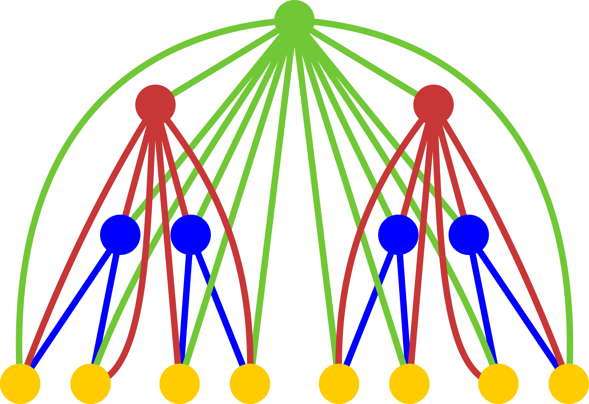
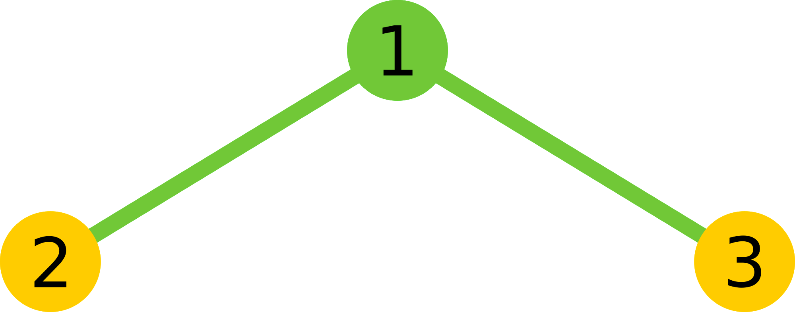

<h1 style='text-align: center;'> D. Singer House</h1>

<h5 style='text-align: center;'>time limit per test: 2 seconds</h5>
<h5 style='text-align: center;'>memory limit per test: 512 megabytes</h5>

It is known that passages in Singer house are complex and intertwined. Let's define a Singer *k*-house as a graph built by the following process: take complete binary tree of height *k* and add edges from each vertex to all its successors, if they are not yet present.

  Singer 4-house Count the number of non-empty paths in Singer *k*-house which do not pass the same vertex twice. Two paths are distinct if the sets or the orders of visited vertices are different. Since the answer can be large, output it modulo 109 + 7.

## Input

The only line contains single integer *k* (1 ≤ *k* ≤ 400).

## Output

Print single integer — the answer for the task modulo 109 + 7.

## Examples

## Input


```
2  

```
## Output


```
9  

```
## Input


```
3  

```
## Output


```
245  

```
## Input


```
20  

```
## Output


```
550384565  

```
## Note

There are 9 paths in the first example (the vertices are numbered on the picture below): 1, 2, 3, 1-2, 2-1, 1-3, 3-1, 2-1-3, 3-1-2.

  Singer 2-house 

#### tags 

#2800 #combinatorics #dp #graphs #trees 