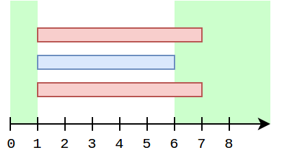
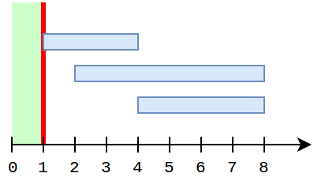
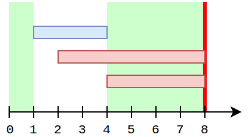

<h1 style='text-align: center;'> E. Caramel Clouds</h1>

<h5 style='text-align: center;'>time limit per test: 3 seconds</h5>
<h5 style='text-align: center;'>memory limit per test: 256 megabytes</h5>

  It is well-known that the best decoration for a flower bed in Sweetland are vanilla muffins. Seedlings of this plant need sun to grow up. Slastyona has *m* seedlings, and the *j*-th seedling needs at least *k**j* minutes of sunlight to grow up.

Most of the time it's sunny in Sweetland, but sometimes some caramel clouds come, the *i*-th of which will appear at time moment (minute) *l**i* and disappear at time moment *r**i*. Of course, the clouds make shadows, and the seedlings can't grow when there is at least one cloud veiling the sun.

Slastyona wants to grow up her muffins as fast as possible. She has exactly *C* candies, which is the main currency in Sweetland. 

One can dispel any cloud by paying *c**i* candies. However, in order to comply with Sweetland's Department of Meteorology regulations, one can't dispel more than two clouds.

Slastyona hasn't decided yet which of the *m* seedlings will be planted at the princess' garden, so she needs your help. For each seedling determine the earliest moment it can grow up if Slastyona won't break the law and won't spend more candies than she has. ## Note

 that each of the seedlings is considered independently.

The seedlings start to grow at time moment 0.

## Input

The first line contains two integers *n* and *C* (0 ≤ *n* ≤ 3·105, 0 ≤ *C* ≤ 109) – the number of caramel clouds and the number of candies Slastyona has.

The next *n* lines contain three integers each: *l**i*, *r**i*, *c**i* (0 ≤ *l**i* < *r**i* ≤ 109, 0 ≤ *c**i* ≤ 109), describing one caramel cloud.

The next line contains single integer *m* (1 ≤ *m* ≤ 3·105) – the number of seedlings. Each of the seedlings is described with one integer *k**j* (1 ≤ *k**j* ≤ 109) – the required number of sunny minutes.

## Output

For each seedling print one integer – the minimum minute Slastyona can grow it up.

## Examples

## Input


```
3 5  
1 7 1  
1 6 2  
1 7 1  
3  
7  
2  
5  

```
## Output


```
12  
7  
10  

```
## Input


```
3 15  
1 4 17  
2 8 6  
4 8 9  
2  
5  
1  

```
## Output


```
8  
1  

```
## Input


```
2 10  
3 7 9  
10 90 10  
2  
10  
100  

```
## Output


```
10  
104  

```
## Note

Consider the first example. For each *k* it is optimal to dispel clouds 1 and 3. Then the remaining cloud will give shadow on time segment [1..6]. So, intervals [0..1] and [6..*inf*) are sunny.

  In the second example for *k* = 1 it is not necessary to dispel anything, and for *k* = 5 the best strategy is to dispel clouds 2 and 3. This adds an additional sunny segment [4..8], which together with [0..1] allows to grow up the muffin at the eight minute.

   If the third example the two seedlings are completely different. For the first one it is necessary to dispel cloud 1 and obtain a sunny segment [0..10]. However, the same strategy gives answer 180 for the second seedling. Instead, we can dispel cloud 2, to make segments [0..3] and [7..*inf*) sunny, and this allows up to shorten the time to 104.


#### tags 

#3400 #data_structures #dp #sortings 