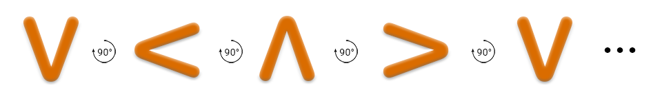

<h1 style='text-align: center;'> A. The Useless Toy</h1>

<h5 style='text-align: center;'>time limit per test: 1 second</h5>
<h5 style='text-align: center;'>memory limit per test: 256 megabytes</h5>

  Walking through the streets of Marshmallow City, Slastyona have spotted some merchants selling a kind of useless toy which is very popular nowadays – caramel spinner! Wanting to join the craze, she has immediately bought the strange contraption.

Spinners in Sweetland have the form of V-shaped pieces of caramel. Each spinner can, well, spin around an invisible magic axis. At a specific point in time, a spinner can take 4 positions shown below (each one rotated 90 degrees relative to the previous, with the fourth one followed by the first one):

  After the spinner was spun, it starts its rotation, which is described by a following algorithm: the spinner maintains its position for a second then majestically switches to the next position in clockwise or counter-clockwise order, depending on the direction the spinner was spun in.

Slastyona managed to have spinner rotating for exactly *n* seconds. Being fascinated by elegance of the process, she completely forgot the direction the spinner was spun in! Lucky for her, she managed to recall the starting position, and wants to deduct the direction given the information she knows. Help her do this.

## Input

There are two characters in the first string – the starting and the ending position of a spinner. The position is encoded with one of the following characters: v (ASCII code 118, lowercase v), < (ASCII code 60), ^ (ASCII code 94) or > (ASCII code 62) (see the picture above for reference). Characters are separated by a single space.

In the second strings, a single number *n* is given (0 ≤ *n* ≤ 109) – the duration of the rotation.

It is guaranteed that the ending position of a spinner is a result of a *n* second spin in any of the directions, assuming the given starting position.

## Output

## Output

 cw, if the direction is clockwise, ccw – if counter-clockwise, and undefined otherwise.

## Examples

## Input


```
^ >  
1  

```
## Output


```
cw  

```
## Input


```
< ^  
3  

```
## Output


```
ccw  

```
## Input


```
^ v  
6  

```
## Output


```
undefined  

```


#### tags 

#900 #implementation 