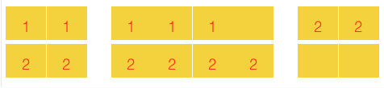

<h1 style='text-align: center;'> B. Game of the Rows</h1>

<h5 style='text-align: center;'>time limit per test: 1 second</h5>
<h5 style='text-align: center;'>memory limit per test: 256 megabytes</h5>

Daenerys Targaryen has an army consisting of *k* groups of soldiers, the *i*-th group contains *a**i* soldiers. She wants to bring her army to the other side of the sea to get the Iron Throne. She has recently bought an airplane to carry her army through the sea. The airplane has *n* rows, each of them has 8 seats. We call two seats neighbor, if they are in the same row and in seats {1, 2}, {3, 4}, {4, 5}, {5, 6} or {7, 8}.

  A row in the airplane Daenerys Targaryen wants to place her army in the plane so that there are no two soldiers from different groups sitting on neighboring seats.

Your task is to determine if there is a possible arranging of her army in the airplane such that the condition above is satisfied.

## Input

The first line contains two integers *n* and *k* (1 ≤ *n* ≤ 10000, 1 ≤ *k* ≤ 100) — the number of rows and the number of groups of soldiers, respectively.

The second line contains *k* integers *a*1, *a*2, *a*3, ..., *a**k* (1 ≤ *a**i* ≤ 10000), where *a**i* denotes the number of soldiers in the *i*-th group.

It is guaranteed that *a*1 + *a*2 + ... + *a**k* ≤ 8·*n*.

## Output

If we can place the soldiers in the airplane print "YES" (without quotes). Otherwise print "NO" (without quotes).

You can choose the case (lower or upper) for each letter arbitrary.

## Examples

## Input


```
2 2  
5 8  

```
## Output


```
YES  

```
## Input


```
1 2  
7 1  

```
## Output


```
NO  

```
## Input


```
1 2  
4 4  

```
## Output


```
YES  

```
## Input


```
1 4  
2 2 1 2  

```
## Output


```
YES  

```
## Note

In the first sample, Daenerys can place the soldiers like in the figure below:

  In the second sample, there is no way to place the soldiers in the plane since the second group soldier will always have a seat neighboring to someone from the first group.

In the third example Daenerys can place the first group on seats (1, 2, 7, 8), and the second group an all the remaining seats.

In the fourth example she can place the first two groups on seats (1, 2) and (7, 8), the third group on seats (3), and the fourth group on seats (5, 6).


#### tags 

#1900 #brute_force #greedy #implementation 