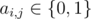
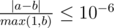

<h1 style='text-align: center;'> E. Mother of Dragons</h1>

<h5 style='text-align: center;'>time limit per test: 2 seconds</h5>
<h5 style='text-align: center;'>memory limit per test: 256 megabytes</h5>

There are *n* castles in the Lannister's Kingdom and some walls connect two castles, no two castles are connected by more than one wall, no wall connects a castle to itself. 

Sir Jaime Lannister has discovered that Daenerys Targaryen is going to attack his kingdom soon. Therefore he wants to defend his kingdom. He has *k* liters of a strange liquid. He wants to distribute that liquid among the castles, so each castle may contain some liquid (possibly zero or non-integer number of liters). After that the stability of a wall is defined as follows: if the wall connects two castles *a* and *b*, and they contain *x* and *y* liters of that liquid, respectively, then the strength of that wall is *x*·*y*.

Your task is to print the maximum possible sum of stabilities of the walls that Sir Jaime Lannister can achieve.

## Input

The first line of the input contains two integers *n* and *k* (1 ≤ *n* ≤ 40, 1 ≤ *k* ≤ 1000).

Then *n* lines follows. The *i*-th of these lines contains *n* integers *a**i*, 1, *a**i*, 2, ..., *a**i*, *n* (). If castles *i* and *j* are connected by a wall, then *a**i*, *j* = 1. Otherwise it is equal to 0.

It is guaranteed that *a**i*, *j* = *a**j*, *i* and *a**i*, *i* = 0 for all 1 ≤ *i*, *j* ≤ *n*.

## Output

Print the maximum possible sum of stabilities of the walls that Sir Jaime Lannister can achieve.

Your answer will be considered correct if its absolute or relative error does not exceed 10- 6.

Namely: let's assume that your answer is *a*, and the answer of the jury is *b*. The checker program will consider your answer correct, if .

## Examples

## Input


```
3 1  
0 1 0  
1 0 0  
0 0 0  

```
## Output


```
0.250000000000  

```
## Input


```
4 4  
0 1 0 1  
1 0 1 0  
0 1 0 1  
1 0 1 0  

```
## Output


```
4.000000000000  

```
## Note

In the first sample, we can assign 0.5, 0.5, 0 liters of liquid to castles 1, 2, 3, respectively, to get the maximum sum (0.25).

In the second sample, we can assign 1.0, 1.0, 1.0, 1.0 liters of liquid to castles 1, 2, 3, 4, respectively, to get the maximum sum (4.0)


#### tags 

#2700 #brute_force #graphs #math #meet-in-the-middle 