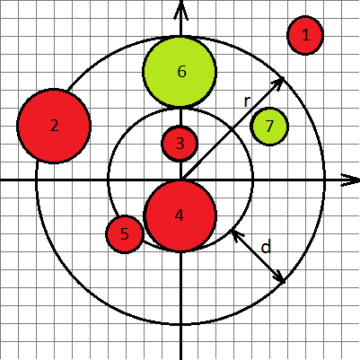

<h1 style='text-align: center;'> B. Gleb And Pizza</h1>

<h5 style='text-align: center;'>time limit per test: 2 seconds</h5>
<h5 style='text-align: center;'>memory limit per test: 256 megabytes</h5>

Gleb ordered pizza home. When the courier delivered the pizza, he was very upset, because several pieces of sausage lay on the crust, and he does not really like the crust.

The pizza is a circle of radius *r* and center at the origin. Pizza consists of the main part — circle of radius *r* - *d* with center at the origin, and crust around the main part of the width *d*. Pieces of sausage are also circles. The radius of the *i* -th piece of the sausage is *r**i*, and the center is given as a pair (*x**i*, *y**i*).

Gleb asks you to help determine the number of pieces of sausage caught on the crust. A piece of sausage got on the crust, if it completely lies on the crust.

## Input

First string contains two integer numbers *r* and *d* (0 ≤ *d* < *r* ≤ 500) — the radius of pizza and the width of crust.

Next line contains one integer number *n* — the number of pieces of sausage (1 ≤ *n* ≤ 105).

Each of next *n* lines contains three integer numbers *x**i*, *y**i* and *r**i* ( - 500 ≤ *x**i*, *y**i* ≤ 500, 0 ≤ *r**i* ≤ 500), where *x**i* and *y**i* are coordinates of the center of *i*-th peace of sausage, *r**i* — radius of *i*-th peace of sausage.

## Output

## Output

 the number of pieces of sausage that lay on the crust.

## Examples

## Input


```
8 4  
7  
7 8 1  
-7 3 2  
0 2 1  
0 -2 2  
-3 -3 1  
0 6 2  
5 3 1  

```
## Output


```
2  

```
## Input


```
10 8  
4  
0 0 9  
0 0 10  
1 0 1  
1 0 2  

```
## Output


```
0  

```
## Note

Below is a picture explaining the first example. Circles of green color denote pieces of sausage lying on the crust.

  

#### tags 

#1100 #geometry 