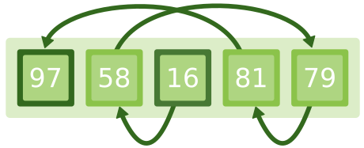

<h1 style='text-align: center;'> B. Interactive LowerBound</h1>

<h5 style='text-align: center;'>time limit per test: 1 second</h5>
<h5 style='text-align: center;'>memory limit per test: 256 megabytes</h5>

This is an interactive problem.

You are given a sorted in increasing order singly linked list. You should find the minimum integer in the list which is greater than or equal to *x*.

More formally, there is a singly liked list built on an array of *n* elements. Element with index *i* contains two integers: *value**i* is the integer value in this element, and *next**i* that is the index of the next element of the singly linked list (or -1, if the current element is the last). The list is sorted, i.e. if *next**i* ≠  - 1, then *value**next**i* > *value**i*.

You are given the number of elements in the list *n*, the index of the first element *start*, and the integer *x*.

You can make up to 2000 queries of the following two types:

* ? i (1 ≤ *i* ≤ *n*) — ask the values *value**i* and *next**i*,
* ! ans — give the answer for the problem: the minimum integer, greater than or equal to *x*, or ! -1, if there are no such integers. Your program should terminate after this query.

Write a program that solves this problem.

## Input

The first line contains three integers *n*, *start*, *x* (1 ≤ *n* ≤ 50000, 1 ≤ *start* ≤ *n*, 0 ≤ *x* ≤ 109) — the number of elements in the list, the index of the first element and the integer *x*.

## Output

To print the answer for the problem, print ! ans, where ans is the minimum integer in the list greater than or equal to *x*, or -1, if there is no such integer.

## Interaction

To make a query of the first type, print ? i (1 ≤ *i* ≤ *n*), where i is the index of element you want to know information about.

After each query of type ? read two integers *value**i* and *next**i* (0 ≤ *value**i* ≤ 109,  - 1 ≤ *next**i* ≤ *n*, *next**i* ≠ 0).

It is guaranteed that if *next**i* ≠  - 1, then *value**next**i* > *value**i*, and that the array values give a valid singly linked list with *start* being the first element.

## Note

 that you can't ask more than 1999 queries of the type ?.

If *next**i* =  - 1 and *value**i* =  - 1, then it means that you asked more queries than allowed, or asked an invalid query. Your program should immediately terminate (for example, by calling exit(0)). You will receive "Wrong Answer", it means that you asked more queries than allowed, or asked an invalid query. If you ignore this, you can get other verdicts since your program will continue to read from a closed stream.

Your solution will get "Idleness Limit Exceeded", if you don't print anything or forget to flush the output, including the final answer.

To flush you can use (just after printing a query and line end):

* fflush(stdout) in C++;
* System.out.flush() in Java;
* stdout.flush() in Python;
* flush(output) in Pascal;
* For other languages see documentation.

Hacks format

For hacks, use the following format:

In the first line print three integers *n*, *start*, *x* (1 ≤ *n* ≤ 50000, 1 ≤ *start* ≤ *n*, 0 ≤ *x* ≤ 109).

In the next *n* lines print the description of the elements of the list: in the *i*-th line print two integers *value**i* and *next**i* (0 ≤ *value**i* ≤ 109,  - 1 ≤ *next**i* ≤ *n*, *next**i* ≠ 0).

The printed structure should be a valid singly linked list. In particular, it should be possible to reach all elements from *start* by following links *next**i*, and the last element *end* should have -1 in the *next**end*.

## Example

## Input


```
5 3 80  
97 -1  
58 5  
16 2  
81 1  
79 4  

```
## Output


```
? 1  
? 2  
? 3  
? 4  
? 5  
! 81
```
## Note

You can read more about singly linked list by the following link: [https://en.wikipedia.org/wiki/Linked_list#Singly_linked_list](https://en.wikipedia.org/wiki/Linked_list#Singly_linked_list) 

The illustration for the first sample case. Start and finish elements are marked dark. 


#### tags 

#2000 #brute_force #interactive #probabilities 