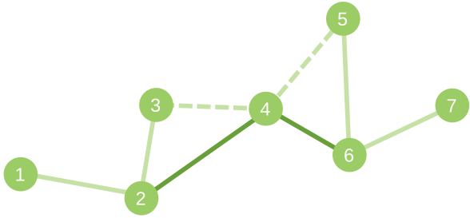

<h1 style='text-align: center;'> C. Upgrading Tree</h1>

<h5 style='text-align: center;'>time limit per test: 4 seconds</h5>
<h5 style='text-align: center;'>memory limit per test: 512 megabytes</h5>

You are given a tree with *n* vertices and you are allowed to perform no more than 2*n* transformations on it. Transformation is defined by three vertices *x*, *y*, *y*' and consists of deleting edge (*x*, *y*) and adding edge (*x*, *y*'). Transformation *x*, *y*, *y*' could be performed if all the following conditions are satisfied:

1. There is an edge (*x*, *y*) in the current tree.
2. After the transformation the graph remains a tree.
3. After the deletion of edge (*x*, *y*) the tree would consist of two connected components. Let's denote the set of nodes in the component containing vertex *x* by *V**x*, and the set of nodes in the component containing vertex *y* by *V**y*. Then condition |*V**x*| > |*V**y*| should be satisfied, i.e. the size of the component with *x* should be strictly larger than the size of the component with *y*.

You should minimize the sum of squared distances between all pairs of vertices in a tree, which you could get after no more than 2*n* transformations and output any sequence of transformations leading initial tree to such state.

## Note

 that you don't need to minimize the number of operations. It is necessary to minimize only the sum of the squared distances.

## Input

The first line of input contains integer *n* (1 ≤ *n* ≤ 2·105) — number of vertices in tree.

The next *n* - 1 lines of input contains integers *a* and *b* (1 ≤ *a*, *b* ≤ *n*, *a* ≠ *b*) — the descriptions of edges. It is guaranteed that the given edges form a tree.

## Output

In the first line output integer *k* (0 ≤ *k* ≤ 2*n*) — the number of transformations from your example, minimizing sum of squared distances between all pairs of vertices.

In each of the next *k* lines output three integers *x*, *y*, *y*' — indices of vertices from the corresponding transformation.

Transformations with *y* = *y*' are allowed (even though they don't change tree) if transformation conditions are satisfied.

If there are several possible answers, print any of them.

## Examples

## Input


```
3  
3 2  
1 3  

```
## Output


```
0  

```
## Input


```
7  
1 2  
2 3  
3 4  
4 5  
5 6  
6 7  

```
## Output


```
2  
4 3 2  
4 5 6
```
## Note

This is a picture for the second sample. Added edges are dark, deleted edges are dotted.




#### tags 

#2600 #constructive_algorithms #dfs_and_similar #graphs #math #trees 