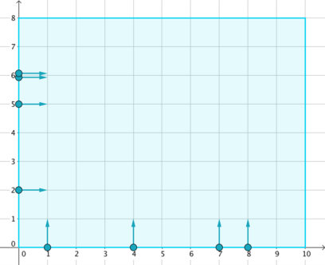
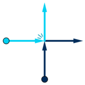
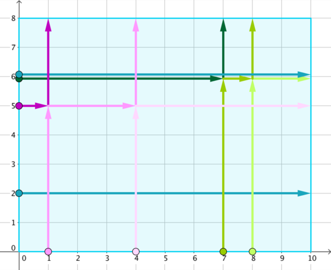

<h1 style='text-align: center;'> B. Rooter's Song</h1>

<h5 style='text-align: center;'>time limit per test: 2 seconds</h5>
<h5 style='text-align: center;'>memory limit per test: 256 megabytes</h5>

Wherever the destination is, whoever we meet, let's render this song together.

On a Cartesian coordinate plane lies a rectangular stage of size *w* × *h*, represented by a rectangle with corners (0, 0), (*w*, 0), (*w*, *h*) and (0, *h*). It can be seen that no collisions will happen before one enters the stage.

On the sides of the stage stand *n* dancers. The *i*-th of them falls into one of the following groups: 

* Vertical: stands at (*x**i*, 0), moves in positive *y* direction (upwards);
* Horizontal: stands at (0, *y**i*), moves in positive *x* direction (rightwards).

  According to choreography, the *i*-th dancer should stand still for the first *t**i* milliseconds, and then start moving in the specified direction at 1 unit per millisecond, until another border is reached. It is guaranteed that no two dancers have the same group, position and waiting time at the same time.

When two dancers collide (i.e. are on the same point at some time when both of them are moving), they immediately exchange their moving directions and go on.

  Dancers stop when a border of the stage is reached. Find out every dancer's stopping position.

## Input

The first line of input contains three space-separated positive integers *n*, *w* and *h* (1 ≤ *n* ≤ 100 000, 2 ≤ *w*, *h* ≤ 100 000) — the number of dancers and the width and height of the stage, respectively.

The following *n* lines each describes a dancer: the *i*-th among them contains three space-separated integers *g**i*, *p**i*, and *t**i* (1 ≤ *g**i* ≤ 2, 1 ≤ *p**i* ≤ 99 999, 0 ≤ *t**i* ≤ 100 000), describing a dancer's group *g**i* (*g**i* = 1 — vertical, *g**i* = 2 — horizontal), position, and waiting time. If *g**i* = 1 then *p**i* = *x**i*; otherwise *p**i* = *y**i*. It's guaranteed that 1 ≤ *x**i* ≤ *w* - 1 and 1 ≤ *y**i* ≤ *h* - 1. It is guaranteed that no two dancers have the same group, position and waiting time at the same time.

## Output

## Output

 *n* lines, the *i*-th of which contains two space-separated integers (*x**i*, *y**i*) — the stopping position of the *i*-th dancer in the input.

## Examples

## Input


```
8 10 8  
1 1 10  
1 4 13  
1 7 1  
1 8 2  
2 2 0  
2 5 14  
2 6 0  
2 6 1  

```
## Output


```
4 8  
10 5  
8 8  
10 6  
10 2  
1 8  
7 8  
10 6  

```
## Input


```
3 2 3  
1 1 2  
2 1 1  
1 1 5  

```
## Output


```
1 3  
2 1  
1 3  

```
## Note

The first example corresponds to the initial setup in the legend, and the tracks of dancers are marked with different colours in the following figure.

  In the second example, no dancers collide.


#### tags 

#1900 #constructive_algorithms #data_structures #geometry #implementation #sortings #two_pointers 