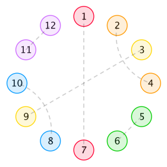
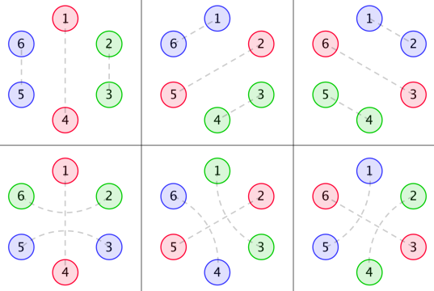
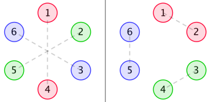

<h1 style='text-align: center;'> E. Days of Floral Colours</h1>

<h5 style='text-align: center;'>time limit per test: 7 seconds</h5>
<h5 style='text-align: center;'>memory limit per test: 256 megabytes</h5>

The Floral Clock has been standing by the side of Mirror Lake for years. Though unable to keep time, it reminds people of the passage of time and the good old days.

On the rim of the Floral Clock are 2*n* flowers, numbered from 1 to 2*n* clockwise, each of which has a colour among all *n* possible ones. For each colour, there are exactly two flowers with it, the distance between which either is less than or equal to 2, or equals *n*. Additionally, if flowers *u* and *v* are of the same colour, then flowers opposite to *u* and opposite to *v* should be of the same colour as well — symmetry is beautiful!

Formally, the distance between two flowers is 1 plus the number of flowers on the minor arc (or semicircle) between them. Below is a possible arrangement with *n* = 6 that cover all possibilities.

  The beauty of an arrangement is defined to be the product of the lengths of flower segments separated by all opposite flowers of the same colour. In other words, in order to compute the beauty, we remove from the circle all flowers that have the same colour as flowers opposite to them. Then, the beauty is the product of lengths of all remaining segments. ## Note

 that we include segments of length 0 in this product. If there are no flowers that have the same colour as flower opposite to them, the beauty equals 0. For instance, the beauty of the above arrangement equals 1 × 3 × 1 × 3 = 9 — the segments are {2}, {4, 5, 6}, {8} and {10, 11, 12}.

While keeping the constraints satisfied, there may be lots of different arrangements. Find out the sum of beauty over all possible arrangements, modulo 998 244 353. Two arrangements are considered different, if a pair (*u*, *v*) (1 ≤ *u*, *v* ≤ 2*n*) exists such that flowers *u* and *v* are of the same colour in one of them, but not in the other.

## Input

The first and only line of input contains a lonely positive integer *n* (3 ≤ *n* ≤ 50 000) — the number of colours present on the Floral Clock.

## Output

## Output

 one integer — the sum of beauty over all possible arrangements of flowers, modulo 998 244 353.

## Examples

## Input


```
3  

```
## Output


```
24  

```
## Input


```
4  

```
## Output


```
4  

```
## Input


```
7  

```
## Output


```
1316  

```
## Input


```
15  

```
## Output


```
3436404  

```
## Note

With *n* = 3, the following six arrangements each have a beauty of 2 × 2 = 4.

  While many others, such as the left one in the figure below, have a beauty of 0. The right one is invalid, since it's asymmetric.

  

#### tags 

#3400 #combinatorics #divide_and_conquer #dp #fft #math 