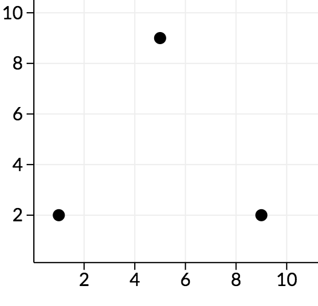

<h1 style='text-align: center;'> A. Five Dimensional Points</h1>

<h5 style='text-align: center;'>time limit per test: 2 seconds</h5>
<h5 style='text-align: center;'>memory limit per test: 256 megabytes</h5>

You are given set of *n* points in 5-dimensional space. The points are labeled from 1 to *n*. No two points coincide.

We will call point *a* bad if there are different points *b* and *c*, not equal to *a*, from the given set such that angle between vectors  and  is acute (i.e. strictly less than ). Otherwise, the point is called good.

The angle between vectors  and  in 5-dimensional space is defined as , where  is the scalar product and  is length of .

Given the list of points, print the indices of the good points in ascending order.

## Input

The first line of input contains a single integer *n* (1 ≤ *n* ≤ 103) — the number of points.

The next *n* lines of input contain five integers *a**i*, *b**i*, *c**i*, *d**i*, *e**i* (|*a**i*|, |*b**i*|, |*c**i*|, |*d**i*|, |*e**i*| ≤ 103)  — the coordinates of the i-th point. All points are distinct.

## Output

First, print a single integer *k* — the number of good points.

Then, print *k* integers, each on their own line — the indices of the good points in ascending order.

## Examples

## Input


```
6  
0 0 0 0 0  
1 0 0 0 0  
0 1 0 0 0  
0 0 1 0 0  
0 0 0 1 0  
0 0 0 0 1  

```
## Output


```
1  
1  

```
## Input


```
3  
0 0 1 2 0  
0 0 9 2 0  
0 0 5 9 0  

```
## Output


```
0  

```
## Note

In the first sample, the first point forms exactly a  angle with all other pairs of points, so it is good.

In the second sample, along the cd plane, we can see the points look as follows:



We can see that all angles here are acute, so no points are good.


#### tags 

#1700 #brute_force #geometry #math 