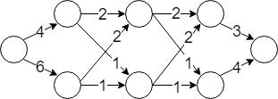

<h1 style='text-align: center;'> B. Neural Network country</h1>

<h5 style='text-align: center;'>time limit per test: 2 seconds</h5>
<h5 style='text-align: center;'>memory limit per test: 256 megabytes</h5>

Due to the recent popularity of the Deep learning new countries are starting to look like Neural Networks. That is, the countries are being built deep with many layers, each layer possibly having many cities. They also have one entry, and one exit point.

There are exactly *L* layers, each having *N* cities. Let us look at the two adjacent layers *L*1 and *L*2. Each city from the layer *L*1 is connected to each city from the layer *L*2 with the traveling cost *c**ij* for , and each pair of adjacent layers has the same cost in between their cities as any other pair (they just stacked the same layers, as usual). Also, the traveling costs to each city from the layer *L*2 are same for all cities in the *L*1, that is *c**ij* is the same for , and fixed *j*.

Doctor G. needs to speed up his computations for this country so he asks you to find the number of paths he can take from entry to exit point such that his traveling cost is divisible by given number *M*.

## Input

The first line of input contains *N* (1 ≤ *N* ≤ 106), *L* (2 ≤ *L* ≤ 105) and *M* (2 ≤ *M* ≤ 100), the number of cities in each layer, the number of layers and the number that travelling cost should be divisible by, respectively.

Second, third and fourth line contain *N* integers each denoting costs 0 ≤ *cost* ≤ *M* from entry point to the first layer, costs between adjacent layers as described above, and costs from the last layer to the exit point.

## Output

## Output

 a single integer, the number of paths Doctor G. can take which have total cost divisible by *M*, modulo 109 + 7.

## Example

## Input


```
2 3 13  
4 6  
2 1  
3 4  

```
## Output


```
2
```
## Note



This is a country with 3 layers, each layer having 2 cities. Paths , and  are the only paths having total cost divisible by 13. Notice that input edges for layer cities have the same cost, and that they are same for all layers.


#### tags 

#2000 #dp #matrices 