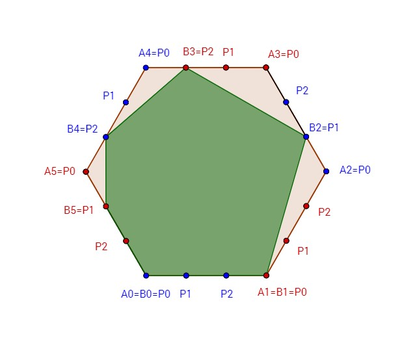

<h1 style='text-align: center;'> C. Property</h1>

<h5 style='text-align: center;'>time limit per test: 0.5 seconds</h5>
<h5 style='text-align: center;'>memory limit per test: 256 megabytes</h5>

Bill is a famous mathematician in BubbleLand. Thanks to his revolutionary math discoveries he was able to make enough money to build a beautiful house. Unfortunately, for not paying property tax on time, court decided to punish Bill by making him lose a part of his property.

Bill’s property can be observed as a convex regular 2*n*-sided polygon *A*0 *A*1... *A*2*n* - 1 *A*2*n*,  *A*2*n* =  *A*0, with sides of the exactly 1 meter in length. 

Court rules for removing part of his property are as follows:

* Split every edge *A**k* *A**k* + 1,  *k* = 0... 2*n* - 1 in *n* equal parts of size 1 / *n* with points *P*0, *P*1, ..., *P**n* - 1
* On every edge *A*2*k* *A*2*k* + 1,  *k* = 0... *n* - 1 court will choose one point *B*2*k* =  *P**i* for some *i* = 0, ...,  *n* - 1 such that 
* On every edge *A*2*k* + 1*A*2*k* + 2,  *k* = 0...*n* - 1 Bill will choose one point *B*2*k* + 1 =  *P**i* for some *i* = 0, ...,  *n* - 1 such that 
* Bill gets to keep property inside of 2*n*-sided polygon *B*0 *B*1... *B*2*n* - 1

Luckily, Bill found out which *B*2*k* points the court chose. Even though he is a great mathematician, his house is very big and he has a hard time calculating. Therefore, he is asking you to help him choose points so he maximizes area of property he can keep.

## Input

The first line contains one integer number *n* (2 ≤ *n* ≤ 50000), representing number of edges of 2*n*-sided polygon.

The second line contains *n* distinct integer numbers *B*2*k* (0 ≤ *B*2*k* ≤ *n* - 1,  *k* = 0... *n* - 1) separated by a single space, representing points the court chose. If *B*2*k* = *i*, the court chose point *P**i* on side *A*2*k* *A*2*k* + 1.

## Output

## Output

 contains *n* distinct integers separated by a single space representing points *B*1, *B*3, ..., *B*2*n* - 1 Bill should choose in order to maximize the property area. If there are multiple solutions that maximize the area, return any of them.

## Example

## Input


```
3  
0 1 2  

```
## Output


```
0 2 1  

```
## Note

To maximize area Bill should choose points: *B*1 = *P*0, *B*3 = *P*2, *B*5 = *P*1




#### tags 

#2100 #greedy #sortings 