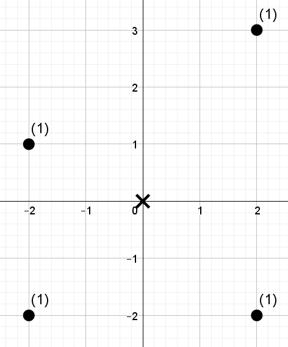
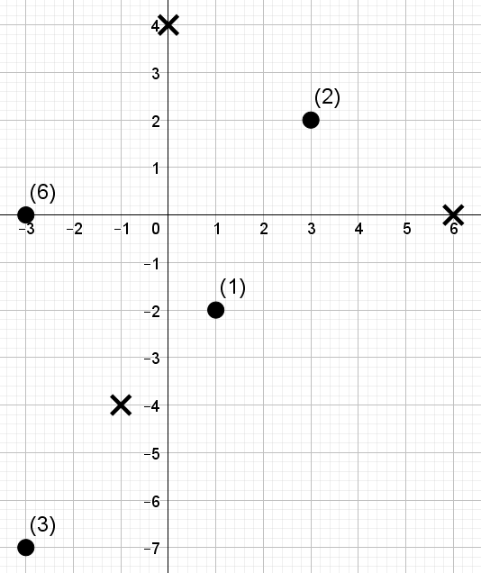

<h1 style='text-align: center;'> E. Lada Malina</h1>

<h5 style='text-align: center;'>time limit per test: 5 seconds</h5>
<h5 style='text-align: center;'>memory limit per test: 256 megabytes</h5>

After long-term research and lots of experiments leading Megapolian automobile manufacturer «AutoVoz» released a brand new car model named «Lada Malina». One of the most impressive features of «Lada Malina» is its highly efficient environment-friendly engines.

Consider car as a point in *Oxy* plane. Car is equipped with *k* engines numbered from 1 to *k*. Each engine is defined by its velocity vector whose coordinates are (*vx**i*, *vy**i*) measured in distance units per day. An engine may be turned on at any level *w**i*, that is a real number between  - 1 and  + 1 (inclusive) that result in a term of (*w**i*·*vx**i*, *w**i*·*vy**i*) in the final car velocity. Namely, the final car velocity is equal to 

(*w*1·*vx*1 + *w*2·*vx*2 + ... + *w**k*·*vx**k*,   *w*1·*vy*1 + *w*2·*vy*2 + ... + *w**k*·*vy**k*) Formally, if car moves with constant values of *w**i* during the whole day then its *x*-coordinate will change by the first component of an expression above, and its *y*-coordinate will change by the second component of an expression above. For example, if all *w**i* are equal to zero, the car won't move, and if all *w**i* are equal to zero except *w*1 = 1, then car will move with the velocity of the first engine.

There are *n* factories in Megapolia, *i*-th of them is located in (*fx**i*, *fy**i*). On the *i*-th factory there are *a**i* cars «Lada Malina» that are ready for operation.

As an attempt to increase sales of a new car, «AutoVoz» is going to hold an international exposition of cars. There are *q* options of exposition location and time, in the *i*-th of them exposition will happen in a point with coordinates (*px**i*, *py**i*) in *t**i* days. 

Of course, at the «AutoVoz» is going to bring as much new cars from factories as possible to the place of exposition. Cars are going to be moved by enabling their engines on some certain levels, such that at the beginning of an exposition car gets exactly to the exposition location. 

However, for some of the options it may be impossible to bring cars from some of the factories to the exposition location by the moment of an exposition. Your task is to determine for each of the options of exposition location and time how many cars will be able to get there by the beginning of an exposition.

## Input

The first line of input contains three integers *k*, *n*, *q* (2 ≤ *k* ≤ 10, 1 ≤ *n* ≤ 105, 1 ≤ *q* ≤ 105), the number of engines of «Lada Malina», number of factories producing «Lada Malina» and number of options of an exposition time and location respectively.

The following *k* lines contain the descriptions of «Lada Malina» engines. The *i*-th of them contains two integers *vx**i*, *vy**i* ( - 1000 ≤ *vx**i*, *vy**i* ≤ 1000) defining the velocity vector of the *i*-th engine. Velocity vector can't be zero, i.e. at least one of *vx**i* and *vy**i* is not equal to zero. It is guaranteed that no two velosity vectors are collinear (parallel).

Next *n* lines contain the descriptions of factories. The *i*-th of them contains two integers *fx**i*, *fy**i*, *a**i* ( - 109 ≤ *fx**i*, *fy**i* ≤ 109, 1 ≤ *a**i* ≤ 109) defining the coordinates of the *i*-th factory location and the number of cars that are located there.

The following *q* lines contain the descriptions of the car exposition. The *i*-th of them contains three integers *px**i*, *py**i*, *t**i* ( - 109 ≤ *px**i*, *py**i* ≤ 109, 1 ≤ *t**i* ≤ 105) defining the coordinates of the exposition location and the number of days till the exposition start in the *i*-th option.

## Output

For each possible option of the exposition output the number of cars that will be able to get to the exposition location by the moment of its beginning.

## Examples

## Input


```
2 4 1  
1 1  
-1 1  
2 3 1  
2 -2 1  
-2 1 1  
-2 -2 1  
0 0 2  

```
## Output


```
3  

```
## Input


```
3 4 3  
2 0  
-1 1  
-1 -2  
-3 0 6  
1 -2 1  
-3 -7 3  
3 2 2  
-1 -4 1  
0 4 2  
6 0 1  

```
## Output


```
4  
9  
0  

```
## Note

Images describing sample tests are given below. Exposition options are denoted with crosses, factories are denoted with points. Each factory is labeled with a number of cars that it has.

First sample test explanation:

* Car from the first factory is not able to get to the exposition location in time.
* Car from the second factory can get to the exposition in time if we set *w*1 = 0, *w*2 = 1.
* Car from the third factory can get to the exposition in time if we set , .
* Car from the fourth factory can get to the exposition in time if we set *w*1 = 1, *w*2 = 0.

   

#### tags 

#3400 #data_structures #geometry 