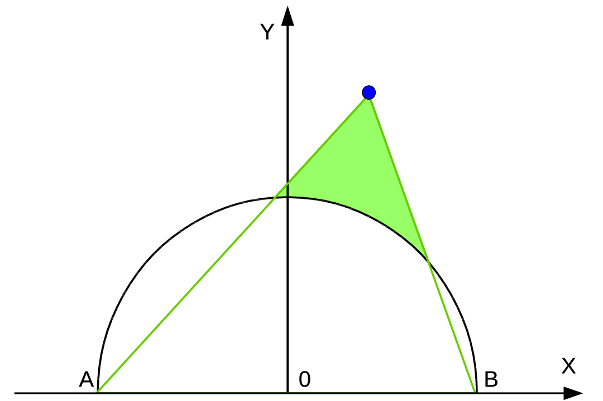
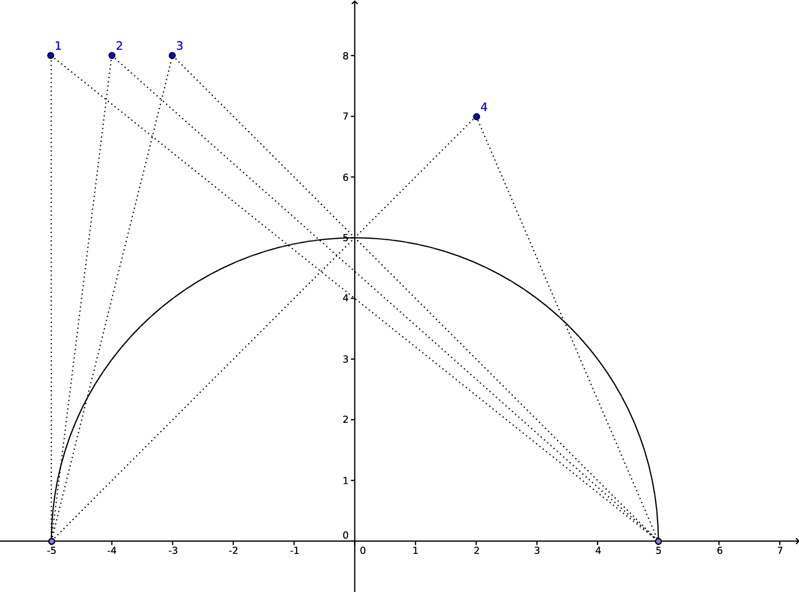

<h1 style='text-align: center;'> E. Satellites</h1>

<h5 style='text-align: center;'>time limit per test: 2 seconds</h5>
<h5 style='text-align: center;'>memory limit per test: 256 megabytes</h5>

Real Cosmic Communications is the largest telecommunication company on a far far away planet, located at the very edge of the universe. RCC launches communication satellites.

The planet is at the very edge of the universe, so its form is half of a circle. Its radius is *r*, the ends of its diameter are points *A* and *B*. The line *AB* is the edge of the universe, so one of the half-planes contains nothing, neither the planet, nor RCC satellites, nor anything else. Let us introduce coordinates in the following way: the origin is at the center of *AB* segment, *OX* axis coincides with line *AB*, the planet is completely in *y* > 0 half-plane.

The satellite can be in any point of the universe, except the planet points. Satellites are never located beyond the edge of the universe, nor on the edge itself — that is, they have coordinate *y* > 0. Satellite antennas are directed in such way that they cover the angle with the vertex in the satellite, and edges directed to points *A* and *B*. Let us call this area the satellite coverage area. 

The picture below shows coordinate system and coverage area of a satellite.

  When RCC was founded there were no satellites around the planet. Since then there have been several events of one of the following types: 

1. 1 x y — launch the new satellite and put it to the point (*x*, *y*). Satellites never move and stay at the point they were launched. Let us assign the number *i* to the *i*-th satellite in order of launching, starting from one.
2. 2 i — remove satellite number *i*.
3. 3 i j — make an attempt to create a communication channel between satellites *i* and *j*. To create a communication channel a repeater is required. It must not be located inside the planet, but can be located at its half-circle border, or above it. Repeater must be in coverage area of both satellites *i* and *j*. To avoid signal interference, it must not be located in coverage area of any other satellite. Of course, the repeater must be within the universe, it must have a coordinate *y* > 0.

For each attempt to create a communication channel you must find out whether it is possible.

Sample test has the following satellites locations: 

  ## Input

The first line of input data contains integers *r* and *n* — radius of the planet and the number of events (1 ≤ *r* ≤ 109, 1 ≤ *n* ≤ 5·105).

Each of the following *n* lines describe events in the specified format.

Satellite coordinates are integer, the satisfy the following constraints |*x*| ≤ 109, 0 < *y* ≤ 109. No two satellites that simultaneously exist can occupy the same point. Distance from each satellite to the center of the planet is strictly greater than *r*.

It is guaranteed that events of types 2 and 3 only refer to satellites that exist at the moment. For all events of type 3 the inequality *i* ≠ *j* is satisfied.

## Output

For each event of type 3 print «YES» on a separate line, if it is possible to create a communication channel, or «NO» if it is impossible.

## Example

## Input


```
5 8  
1 -5 8  
1 -4 8  
1 -3 8  
1 2 7  
3 1 3  
2 2  
3 1 3  
3 3 4  

```
## Output


```
NO  
YES  
YES  

```


#### tags 

#3100 