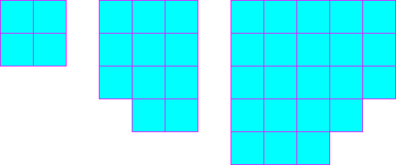

<h1 style='text-align: center;'> B. Lazy Security Guard</h1>

<h5 style='text-align: center;'>time limit per test: 2 seconds</h5>
<h5 style='text-align: center;'>memory limit per test: 256 megabytes</h5>

Your security guard friend recently got a new job at a new security company. The company requires him to patrol an area of the city encompassing exactly *N* city blocks, but they let him choose which blocks. That is, your friend must walk the perimeter of a region whose area is exactly *N* blocks. Your friend is quite lazy and would like your help to find the shortest possible route that meets the requirements. The city is laid out in a square grid pattern, and is large enough that for the sake of the problem it can be considered infinite.

## Input

## Input

 will consist of a single integer *N* (1 ≤ *N* ≤ 106), the number of city blocks that must be enclosed by the route.

## Output

Print the minimum perimeter that can be achieved.

## Examples

## Input


```
4  

```
## Output


```
8  

```
## Input


```
11  

```
## Output


```
14  

```
## Input


```
22  

```
## Output


```
20  

```
## Note

Here are some possible shapes for the examples:




#### tags 

#1000 #brute_force #geometry #math 