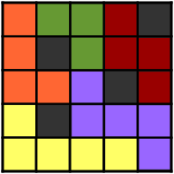

<h1 style='text-align: center;'> B. Tetris revisited</h1>

<h5 style='text-align: center;'>time limit per test: 1 second</h5>
<h5 style='text-align: center;'>memory limit per test: 256 megabytes</h5>

Physicist Woll likes to play one relaxing game in between his search of the theory of everything.

Game interface consists of a rectangular *n* × *m* playing field and a dashboard. Initially some cells of the playing field are filled while others are empty. Dashboard contains images of all various connected (we mean connectivity by side) figures of 2, 3, 4 and 5 cells, with all their rotations and reflections. Player can copy any figure from the dashboard and place it anywhere at the still empty cells of the playing field. Of course any figure can be used as many times as needed.

Woll's aim is to fill the whole field in such a way that there are no empty cells left, and also... just have some fun.

Every initially empty cell should be filled with exactly one cell of some figure. Every figure should be entirely inside the board.

  In the picture black cells stand for initially filled cells of the field, and one-colour regions represent the figures.

## Input

First line contains integers *n* and *m* (1 ≤ *n*, *m* ≤ 1000) — the height and the width of the field correspondingly. Next *n* lines contain *m* symbols each. They represent the field in a natural way: *j*-th character of the *i*-th line is "#" if the corresponding cell is filled, and "." if it is empty.

## Output

If there is no chance to win the game output the only number "-1" (without the quotes). Otherwise output any filling of the field by the figures in the following format: each figure should be represented by some digit and figures that touch each other by side should be represented by distinct digits. Every initially filled cell should be represented by "#".

## Examples

## Input


```
2 3  
...  
#.#  

```
## Output


```
000  
#0#  

```
## Input


```
3 3  
.#.  
...  
..#  

```
## Output


```
5#1  
511  
55#  

```
## Input


```
3 3  
...  
.##  
.#.  

```
## Output


```
-1  

```
## Input


```
1 2  
##  

```
## Output


```
##  

```
## Note

In the third sample, there is no way to fill a cell with no empty neighbours.

In the forth sample, Woll does not have to fill anything, so we should output the field from the input.


#### tags 

#2200 #constructive_algorithms #graph_matchings #greedy #math 