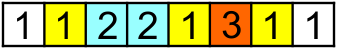

<h1 style='text-align: center;'> D. Powerful array</h1>

<h5 style='text-align: center;'>time limit per test: 5 seconds</h5>
<h5 style='text-align: center;'>memory limit per test: 256 megabytes</h5>

An array of positive integers *a*1, *a*2, ..., *a**n* is given. Let us consider its arbitrary subarray *a**l*, *a**l* + 1..., *a**r*, where 1 ≤ *l* ≤ *r* ≤ *n*. For every positive integer *s* denote by *K**s* the number of occurrences of *s* into the subarray. We call the power of the subarray the sum of products *K**s*·*K**s*·*s* for every positive integer *s*. The sum contains only finite number of nonzero summands as the number of different values in the array is indeed finite.

You should calculate the power of *t* given subarrays.

## Input

First line contains two integers *n* and *t* (1 ≤ *n*, *t* ≤ 200000) — the array length and the number of queries correspondingly.

Second line contains *n* positive integers *a**i* (1 ≤ *a**i* ≤ 106) — the elements of the array.

Next *t* lines contain two positive integers *l*, *r* (1 ≤ *l* ≤ *r* ≤ *n*) each — the indices of the left and the right ends of the corresponding subarray.

## Output

## Output

 *t* lines, the *i*-th line of the output should contain single positive integer — the power of the *i*-th query subarray.

Please, do not use %lld specificator to read or write 64-bit integers in C++. It is preferred to use cout stream (also you may use %I64d).

## Examples

## Input


```
3 2  
1 2 1  
1 2  
1 3  

```
## Output


```
3  
6  

```
## Input


```
8 3  
1 1 2 2 1 3 1 1  
2 7  
1 6  
2 7  

```
## Output


```
20  
20  
20  

```
## Note

Consider the following array (see the second sample) and its [2, 7] subarray (elements of the subarray are colored): 

 Then *K*1 = 3, *K*2 = 2, *K*3 = 1, so the power is equal to 32·1 + 22·2 + 12·3 = 20.

#### tags 

#2200 #data_structures #implementation #math #two_pointers 