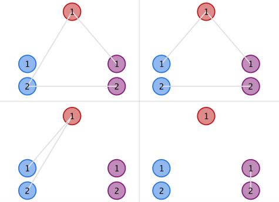

<h1 style='text-align: center;'> C. The Intriguing Obsession</h1>

<h5 style='text-align: center;'>time limit per test: 1 second</h5>
<h5 style='text-align: center;'>memory limit per test: 256 megabytes</h5>

— This is not playing but duty as allies of justice, Nii-chan!

— Not allies but justice itself, Onii-chan!

With hands joined, go everywhere at a speed faster than our thoughts! This time, the Fire Sisters — Karen and Tsukihi — is heading for somewhere they've never reached — water-surrounded islands!

There are three clusters of islands, conveniently coloured red, blue and purple. The clusters consist of *a*, *b* and *c* distinct islands respectively.

Bridges have been built between some (possibly all or none) of the islands. A bridge bidirectionally connects two different islands and has length 1. For any two islands of the same colour, either they shouldn't be reached from each other through bridges, or the shortest distance between them is at least 3, apparently in order to prevent oddities from spreading quickly inside a cluster.

The Fire Sisters are ready for the unknown, but they'd also like to test your courage. And you're here to figure out the number of different ways to build all bridges under the constraints, and give the answer modulo 998 244 353. Two ways are considered different if a pair of islands exist, such that there's a bridge between them in one of them, but not in the other.

## Input

The first and only line of input contains three space-separated integers *a*, *b* and *c* (1 ≤ *a*, *b*, *c* ≤ 5 000) — the number of islands in the red, blue and purple clusters, respectively.

## Output

## Output

 one line containing an integer — the number of different ways to build bridges, modulo 998 244 353.

## Examples

## Input


```
1 1 1  

```
## Output


```
8  

```
## Input


```
1 2 2  

```
## Output


```
63  

```
## Input


```
1 3 5  

```
## Output


```
3264  

```
## Input


```
6 2 9  

```
## Output


```
813023575  

```
## Note

In the first example, there are 3 bridges that can possibly be built, and no setup of bridges violates the restrictions. Thus the answer is 23 = 8.

In the second example, the upper two structures in the figure below are instances of valid ones, while the lower two are invalid due to the blue and purple clusters, respectively.

  

#### tags 

#1800 #combinatorics #dp #math 