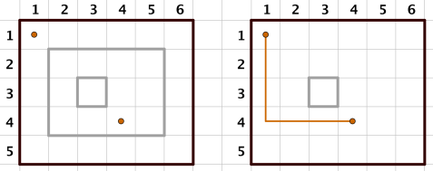

<h1 style='text-align: center;'> E. The Untended Antiquity</h1>

<h5 style='text-align: center;'>time limit per test: 2 seconds</h5>
<h5 style='text-align: center;'>memory limit per test: 512 megabytes</h5>

Adieu l'ami.

Koyomi is helping Oshino, an acquaintance of his, to take care of an open space around the abandoned Eikou Cram School building, Oshino's makeshift residence.

The space is represented by a rectangular grid of *n* × *m* cells, arranged into *n* rows and *m* columns. The *c*-th cell in the *r*-th row is denoted by (*r*, *c*).

Oshino places and removes barriers around rectangular areas of cells. Specifically, an action denoted by "1 *r*1 *c*1 *r*2 *c*2" means Oshino's placing barriers around a rectangle with two corners being (*r*1, *c*1) and (*r*2, *c*2) and sides parallel to squares sides. Similarly, "2 *r*1 *c*1 *r*2 *c*2" means Oshino's removing barriers around the rectangle. Oshino ensures that no barriers staying on the ground share any common points, nor do they intersect with boundaries of the *n* × *m* area.

Sometimes Koyomi tries to walk from one cell to another carefully without striding over barriers, in order to avoid damaging various items on the ground. "3 *r*1 *c*1 *r*2 *c*2" means that Koyomi tries to walk from (*r*1, *c*1) to (*r*2, *c*2) without crossing barriers.

And you're here to tell Koyomi the feasibility of each of his attempts.

## Input

The first line of input contains three space-separated integers *n*, *m* and *q* (1 ≤ *n*, *m* ≤ 2 500, 1 ≤ *q* ≤ 100 000) — the number of rows and columns in the grid, and the total number of Oshino and Koyomi's actions, respectively.

The following *q* lines each describes an action, containing five space-separated integers *t*, *r*1, *c*1, *r*2, *c*2 (1 ≤ *t* ≤ 3, 1 ≤ *r*1, *r*2 ≤ *n*, 1 ≤ *c*1, *c*2 ≤ *m*) — the type and two coordinates of an action. Additionally, the following holds depending on the value of *t*: 

* If *t* = 1: 2 ≤ *r*1 ≤ *r*2 ≤ *n* - 1, 2 ≤ *c*1 ≤ *c*2 ≤ *m* - 1;
* If *t* = 2: 2 ≤ *r*1 ≤ *r*2 ≤ *n* - 1, 2 ≤ *c*1 ≤ *c*2 ≤ *m* - 1, the specified group of barriers exist on the ground before the removal.
* If *t* = 3: no extra restrictions.
## Output

For each of Koyomi's attempts (actions with *t* = 3), output one line — containing "Yes" (without quotes) if it's feasible, and "No" (without quotes) otherwise.

## Examples

## Input


```
5 6 5  
1 2 2 4 5  
1 3 3 3 3  
3 4 4 1 1  
2 2 2 4 5  
3 1 1 4 4  

```
## Output


```
No  
Yes  

```
## Input


```
2500 2500 8  
1 549 1279 1263 2189  
1 303 795 1888 2432  
1 2227 622 2418 1161  
3 771 2492 1335 1433  
1 2017 2100 2408 2160  
3 48 60 798 729  
1 347 708 1868 792  
3 1940 2080 377 1546  

```
## Output


```
No  
Yes  
No  

```
## Note

For the first example, the situations of Koyomi's actions are illustrated below.

  

#### tags 

#2400 #data_structures #hashing 