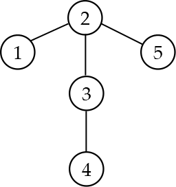

<h1 style='text-align: center;'> E. Restore the Tree</h1>

<h5 style='text-align: center;'>time limit per test: 3 seconds</h5>
<h5 style='text-align: center;'>memory limit per test: 256 megabytes</h5>

Petya had a tree consisting of *n* vertices numbered with integers from 1 to *n*. Accidentally he lost his tree. 

Petya remembers information about *k* vertices: distances from each of them to each of the *n* tree vertices.

Your task is to restore any tree that satisfies the information that Petya remembers or report that such tree doesn't exist.

## Input

The first line contains two integers *n* and *k* (2 ≤ *n* ≤ 30 000, 1 ≤ *k* ≤ *min*(200, *n*)) — the number of vertices in the tree and the number of vertices about which Petya remembers distance information.

The following *k* lines contain remembered information. The *i*-th line contains *n* integers *d**i*, 1, *d**i*, 2, ..., *d**i*, *n* (0 ≤ *d**i*, *j* ≤ *n* - 1), where *d**i*, *j* — the distance to *j*-th vertex from the *i*-th vertex that Petya remembers.

## Output

If there are no suitable trees, print -1.

In the other case, print *n* - 1 lines: each line should contain two vertices connected by edge in the required tree. You can print edges and vertices in an edge in any order. The tree vertices are enumerated from 1 to *n*.

If there are many solutions print any of them.

## Examples

## Input


```
5 2  
0 1 2 3 2  
2 1 0 1 2  

```
## Output


```
2 1  
3 2  
4 3  
5 2  

```
## Input


```
3 1  
1 2 1  

```
## Output


```
-1  

```
## Note

Picture for the first sample:

  

#### tags 

#2900 #graphs #greedy #trees 