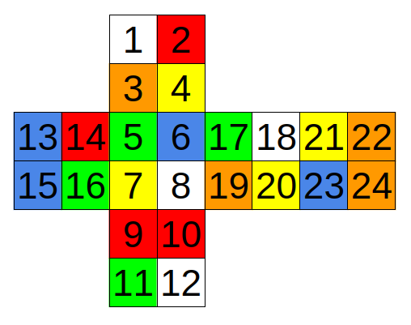
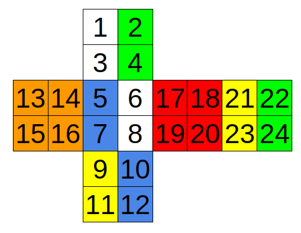

<h1 style='text-align: center;'> C. Solution for Cube</h1>

<h5 style='text-align: center;'>time limit per test: 2 seconds</h5>
<h5 style='text-align: center;'>memory limit per test: 256 megabytes</h5>

During the breaks between competitions, top-model Izabella tries to develop herself and not to be bored. For example, now she tries to solve Rubik's cube 2x2x2.

It's too hard to learn to solve Rubik's cube instantly, so she learns to understand if it's possible to solve the cube in some state using 90-degrees rotation of one face of the cube in any direction.

To check her answers she wants to use a program which will for some state of cube tell if it's possible to solve it using one rotation, described above.

Cube is called solved if for each face of cube all squares on it has the same color.

https://en.wikipedia.org/wiki/Rubik's_Cube

## Input

In first line given a sequence of 24 integers *a**i* (1 ≤ *a**i* ≤ 6), where *a**i* denotes color of *i*-th square. There are exactly 4 occurrences of all colors in this sequence.

## Output

Print «YES» (without quotes) if it's possible to solve cube using one rotation and «NO» (without quotes) otherwise.

## Examples

## Input


```
2 5 4 6 1 3 6 2 5 5 1 2 3 5 3 1 1 2 4 6 6 4 3 4  

```
## Output


```
NO
```
## Input


```
5 3 5 3 2 5 2 5 6 2 6 2 4 4 4 4 1 1 1 1 6 3 6 3  

```
## Output


```
YES
```
## Note

In first test case cube looks like this:

  In second test case cube looks like this: 

  It's possible to solve cube by rotating face with squares with numbers 13, 14, 15, 16.


#### tags 

#1500 #brute_force #implementation 