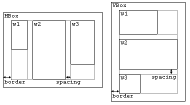
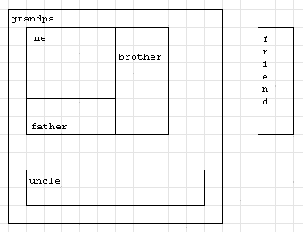

<h1 style='text-align: center;'> B. Widget Library</h1>

<h5 style='text-align: center;'>time limit per test: 2 seconds</h5>
<h5 style='text-align: center;'>memory limit per test: 256 megabytes</h5>

Vasya writes his own library for building graphical user interface. Vasya called his creation VTK (VasyaToolKit). One of the interesting aspects of this library is that widgets are packed in each other. 

A widget is some element of graphical interface. Each widget has width and height, and occupies some rectangle on the screen. Any widget in Vasya's library is of type Widget. For simplicity we will identify the widget and its type. 

Types HBox and VBox are derivatives of type Widget, so they also are types Widget. Widgets HBox and VBox are special. They can store other widgets. Both those widgets can use the pack() method to pack directly in itself some other widget. Widgets of types HBox and VBox can store several other widgets, even several equal widgets — they will simply appear several times. As a result of using the method pack() only the link to the packed widget is saved, that is when the packed widget is changed, its image in the widget, into which it is packed, will also change. 

We shall assume that the widget *a* is packed in the widget *b* if there exists a chain of widgets *a* = *c*1, *c*2, ..., *c**k* = *b*, *k* ≥ 2, for which *c**i* is packed directly to *c**i* + 1 for any 1 ≤ *i* < *k*. In Vasya's library the situation when the widget *a* is packed in the widget *a* (that is, in itself) is not allowed. If you try to pack the widgets into each other in this manner immediately results in an error.

Also, the widgets HBox and VBox have parameters border and spacing, which are determined by the methods set_border() and set_spacing() respectively. By default both of these options equal 0. 

   The picture above shows how the widgets are packed into HBox and VBox. At that HBox and VBox automatically change their size depending on the size of packed widgets. As for HBox and VBox, they only differ in that in HBox the widgets are packed horizontally and in VBox — vertically. The parameter spacing sets the distance between adjacent widgets, and border — a frame around all packed widgets of the desired width. Packed widgets are placed exactly in the order in which the pack() method was called for them. If within HBox or VBox there are no packed widgets, their sizes are equal to 0 × 0, regardless of the options border and spacing. 

The construction of all the widgets is performed using a scripting language VasyaScript. The description of the language can be found in the input data. 

For the final verification of the code Vasya asks you to write a program that calculates the sizes of all the widgets on the source code in the language of VasyaScript. 

## Input

The first line contains an integer *n* — the number of instructions (1 ≤ *n* ≤ 100). Next *n* lines contain instructions in the language VasyaScript — one instruction per line. There is a list of possible instructions below. 

* "Widget [name]([x],[y])" — create a new widget [name] of the type Widget possessing the width of [x] units and the height of [y] units.
* "HBox [name]" — create a new widget [name] of the type HBox.
* "VBox [name]" — create a new widget [name] of the type VBox.
* "[name1].pack([name2])" — pack the widget [name2] in the widget [name1]. At that, the widget [name1] must be of type HBox or VBox.
* "[name].set_border([x])" — set for a widget [name] the border parameter to [x] units. The widget [name] must be of type HBox or VBox.
* "[name].set_spacing([x])" — set for a widget [name] the spacing parameter to [x] units. The widget [name] must be of type HBox or VBox.

 All instructions are written without spaces at the beginning and at the end of the string. The words inside the instruction are separated by exactly one space. There are no spaces directly before the numbers and directly after them. 

The case matters, for example, "wiDget x" is not a correct instruction. The case of the letters is correct in the input data.

All names of the widgets consist of lowercase Latin letters and has the length from 1 to 10 characters inclusive. The names of all widgets are pairwise different. All numbers in the script are integers from 0 to 100 inclusive

It is guaranteed that the above-given script is correct, that is that all the operations with the widgets take place after the widgets are created and no widget is packed in itself. It is guaranteed that the script creates at least one widget. 

## Output

For each widget print on a single line its name, width and height, separated by spaces. The lines must be ordered lexicographically by a widget's name. 

Please, do not use the %lld specificator to read or write 64-bit integers in C++. It is preferred to use cout stream (also you may use %I64d specificator)

## Examples

## Input


```
12  
Widget me(50,40)  
VBox grandpa  
HBox father  
grandpa.pack(father)  
father.pack(me)  
grandpa.set_border(10)  
grandpa.set_spacing(20)  
Widget brother(30,60)  
father.pack(brother)  
Widget friend(20,60)  
Widget uncle(100,20)  
grandpa.pack(uncle)  

```
## Output


```
brother 30 60  
father 80 60  
friend 20 60  
grandpa 120 120  
me 50 40  
uncle 100 20  

```
## Input


```
15  
Widget pack(10,10)  
HBox dummy  
HBox x  
VBox y  
y.pack(dummy)  
y.set_border(5)  
y.set_spacing(55)  
dummy.set_border(10)  
dummy.set_spacing(20)  
x.set_border(10)  
x.set_spacing(10)  
x.pack(pack)  
x.pack(dummy)  
x.pack(pack)  
x.set_border(0)  

```
## Output


```
dummy 0 0  
pack 10 10  
x 40 10  
y 10 10  

```
## Note

In the first sample the widgets are arranged as follows: 

  

#### tags 

#2300 #dp #expression_parsing #graphs #implementation 