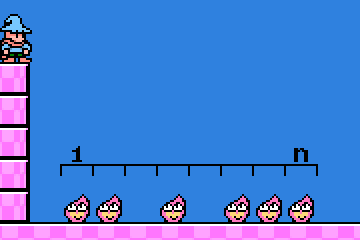

<h1 style='text-align: center;'> E. Fire and Ice</h1>

<h5 style='text-align: center;'>time limit per test: 0.5 second</h5>
<h5 style='text-align: center;'>memory limit per test: 256 megabytes</h5>

The Fire Lord attacked the Frost Kingdom. He has already got to the Ice Fortress, where the Snow Queen dwells. He arranged his army on a segment *n* in length not far from the city walls. And only the frost magician Solomon can save the Frost Kingdom.

  The *n*-long segment is located at a distance equal exactly to 1 from the castle walls. It can be imaginarily divided into unit segments. On some of the unit segments fire demons are located — no more than one demon per position. Each demon is characterised by his strength - by some positive integer. We can regard the fire demons being idle.

Initially Solomon is positioned on the fortress wall. He can perform the following actions several times in a row: 

* "L" — Solomon shifts one unit to the left. This movement cannot be performed on the castle wall.
* "R" — Solomon shifts one unit to the left. This movement cannot be performed if there's no ice block to the right.
* "A" — If there's nothing to the right of Solomon, then Solomon creates an ice block that immediately freezes to the block that Solomon is currently standing on. If there already is an ice block, then Solomon destroys it. At that the ice blocks to the right of the destroyed one can remain but they are left unsupported. Those ice blocks fall down.

Solomon spends exactly a second on each of these actions.

As the result of Solomon's actions, ice blocks' segments fall down. When an ice block falls on a fire demon, the block evaporates and the demon's strength is reduced by 1. When the demons' strength is equal to 0, the fire demon vanishes. The picture below shows how it happens. The ice block that falls on the position with no demon, breaks into lots of tiny pieces and vanishes without hurting anybody.

  Help Solomon destroy all the Fire Lord's army in minimum time.

## Input

The first line contains an integer *n* (1 ≤ *n* ≤ 1000). The next line contains *n* numbers, the *i*-th of them represents the strength of the fire demon standing of the *i*-th position, an integer from 1 to 100. If there's no demon on the *i*-th position, then the *i*-th number equals to 0. It is guaranteed that the input data have at least one fire demon.

## Output

Print a string of minimum length, containing characters "L", "R" and "A" — the succession of actions leading to the required result.

If there are several possible answers, print any of them.

## Examples

## Input


```
3  
1 0 1  

```
## Output


```
ARARARALLLA
```
## Input


```
3  
0 2 0  

```
## Output


```
ARARALAARALA
```


#### tags 

#2900 #greedy 