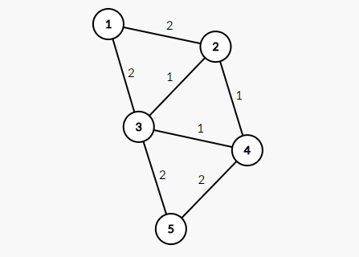

<h1 style='text-align: center;'> C. Envy</h1>

<h5 style='text-align: center;'>time limit per test: 2 seconds</h5>
<h5 style='text-align: center;'>memory limit per test: 256 megabytes</h5>

For a connected undirected weighted graph *G*, MST (minimum spanning tree) is a subgraph of *G* that contains all of *G*'s vertices, is a tree, and sum of its edges is minimum possible.

You are given a graph *G*. If you run a MST algorithm on graph it would give you only one MST and it causes other edges to become jealous. You are given some queries, each query contains a set of edges of graph *G*, and you should determine whether there is a MST containing all these edges or not.

## Input

The first line contains two integers *n*, *m* (2  ≤ *n*, *m*  ≤ 5·105, *n* - 1 ≤ *m*) — the number of vertices and edges in the graph and the number of queries.

The *i*-th of the next *m* lines contains three integers *u**i*, *v**i*, *w**i* (*u**i* ≠ *v**i*, 1 ≤ *w**i* ≤ 5·105) — the endpoints and weight of the *i*-th edge. There can be more than one edges between two vertices. It's guaranteed that the given graph is connected.

The next line contains a single integer *q* (1 ≤ *q* ≤ 5·105) — the number of queries.

*q* lines follow, the *i*-th of them contains the *i*-th query. It starts with an integer *k**i* (1 ≤ *k**i* ≤ *n* - 1) — the size of edges subset and continues with *k**i* distinct space-separated integers from 1 to *m* — the indices of the edges. It is guaranteed that the sum of *k**i* for 1 ≤ *i* ≤ *q* does not exceed 5·105.

## Output

For each query you should print "YES" (without quotes) if there's a MST containing these edges and "NO" (of course without quotes again) otherwise.

## Example

## Input


```
5 7  
1 2 2  
1 3 2  
2 3 1  
2 4 1  
3 4 1  
3 5 2  
4 5 2  
4  
2 3 4  
3 3 4 5  
2 1 7  
2 1 2  

```
## Output


```
YES  
NO  
YES  
NO  

```
## Note

This is the graph of sample:

  Weight of minimum spanning tree on this graph is 6.

MST with edges (1, 3, 4, 6), contains all of edges from the first query, so answer on the first query is "YES".

Edges from the second query form a cycle of length 3, so there is no spanning tree including these three edges. Thus, answer is "NO".


#### tags 

#2300 #data_structures #dsu #graphs 